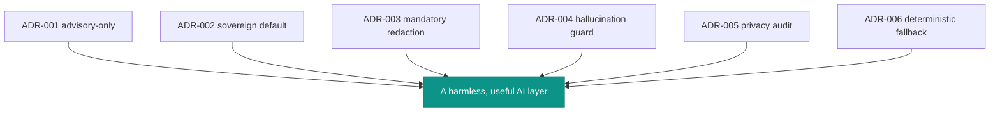

# Architecture decisions (ADR)

This page consolidates the decisions that shape the module. Each is stated as *Problem → Decision →
Consequences*. The deep concept pages carry the full theory; this is the index of *why*.

## ADR-001 — Advisory-only, enforced by type and pipeline

::: collapsible open "Problem → Decision → Consequences"
**Problem.** LLM output is useful for explanation/drafting but unsafe as an authorization signal.

**Decision.** Confine the AI to an advisory layer beside the PDP, never inside it. The only output type is
`Advisory` (`advisory_only = true`, no verdict field). Authorization stays a pure function of the
deterministic PDP; concrete modules *explain* decisions already made and are fail-closed.

**Consequences.** Decision capture must be written on purpose and against the types ✅ · the AI can be
disabled/fail/hallucinate with zero enforcement impact ✅ · the module cannot auto-remediate access ⚠️ ·
callers must still call the PDP to enforce ⚠️.

→ [Advisory-only authorization](/concepts/advisory-only)
:::

## ADR-002 — Sovereign and off by default; no provider in the core

::: collapsible "Problem → Decision → Consequences"
**Problem.** Sensitive IAM metadata must not leak to non-sovereign model APIs.

**Decision.** Ship `enabled=false` and `provider='disabled'`. Depend only on the `AiProvider` interface; keep
concrete transports in optional adapter packages. Recommend Regolo (EU) / Ollama (on-prem); never add an AI
SDK to `require`; resolve unknown providers to `DisabledProvider`.

**Consequences.** Data residency is the default ✅ · install adds no egress and no third-party SDK ✅ ·
enabling AI is explicit and auditable ✅ · you must install an adapter to get assistance ⚠️ · vendor
sovereignty remains your responsibility ⚠️.

→ [Sovereign by default](/concepts/sovereign-by-default)
:::

## ADR-003 — Mandatory, fail-safe redaction on input and output

::: collapsible "Problem → Decision → Consequences"
**Problem.** Prompts and outputs can carry secrets/PII to a provider whose logs you don't control.

**Decision.** Make redaction a mandatory stage of `AdvisoryClient`, run on the input before transmission and
again on the output before return/audit. Deterministic, ordered regex pipeline biased toward over-redaction.
Surface `didRedact`; never store the original.

**Consequences.** No AI call can transmit an un-redacted prompt ✅ · output leaks caught on the way back ✅ ·
audit records *that* redaction happened ✅ · innocent long hex/base64 can be mangled ⚠️ · novel secret formats
may slip — it's a floor, not a DLP ⚠️.

→ [PRE-prompt redaction](/concepts/redaction)
:::

## ADR-004 — Whitelist hallucination guard over an identifier grammar

::: collapsible "Problem → Decision → Consequences"
**Problem.** Models fabricate authoritative-looking IDs; a fake `decision_id`/grant in an IAM explanation is
dangerous.

**Decision.** After the model returns, extract identifier-shaped tokens (prefixed, ULID, UUID) and reject any
not in `allowedRefs` from real evidence. A violation discards the output and returns the deterministic
fallback, flagging `guardPassed=false` and recording the violations.

**Consequences.** The model can't present invented evidence ✅ · violations are observable ✅ · covers
prefixed/ULID/UUID ✅ · guards identifiers, not claim correctness ⚠️ · plain integer IDs aren't recognized ⚠️.

→ [The hallucination guard](/concepts/hallucination-guard)
:::

## ADR-005 — Privacy-by-default audit: store the act, not the secret

::: collapsible "Problem → Decision → Consequences"
**Problem.** AI governance needs an audit trail that doesn't become a secret store.

**Decision.** Record every advisory on every path under `stream=ai` / `iam.ai.advisory` with governance
metadata. Never store prompts (`store_prompts=false`, hard default). Store outputs only with
`store_outputs=true`, and only the redacted text. Record `violations` as a count, not the IDs.

**Consequences.** Full observability without a secret-bearing log ✅ · output retention is explicit, opt-in,
sanitized ✅ · shares the server's tamper-evident stream ✅ · no exact prompt replay ⚠️ · `store_outputs`
persists model text — bound retention ⚠️.

→ [Audit & privacy](/concepts/audit-and-privacy)
:::

## ADR-006 — Mandatory, total deterministic fallback

::: collapsible "Problem → Decision → Consequences"
**Problem.** AI calls fail in many ways; a governance layer must never surface those as errors or open state.

**Decision.** Require a `deterministicFallback` on every `advise()`. Make `advise()` total: every non-clean
branch returns the fallback. Catch all transport throwables; resolve misconfiguration to the inert provider so
"on without an adapter" fails safe.

**Consequences.** No AI failure becomes a user error or open decision ✅ · callers get a usable answer and can
ignore transport exceptions ✅ · failures still audited ✅ · fallback quality is the caller's responsibility ⚠️
· always-falling-back can hide a broken provider — monitor `ai_used` ⚠️.

→ [Fail-safe & fallback](/architecture/fail-safe-and-fallback)
:::

## Decision map

## See also

- [Architecture overview](/architecture/overview)
- [Core concepts](/core-concepts)
