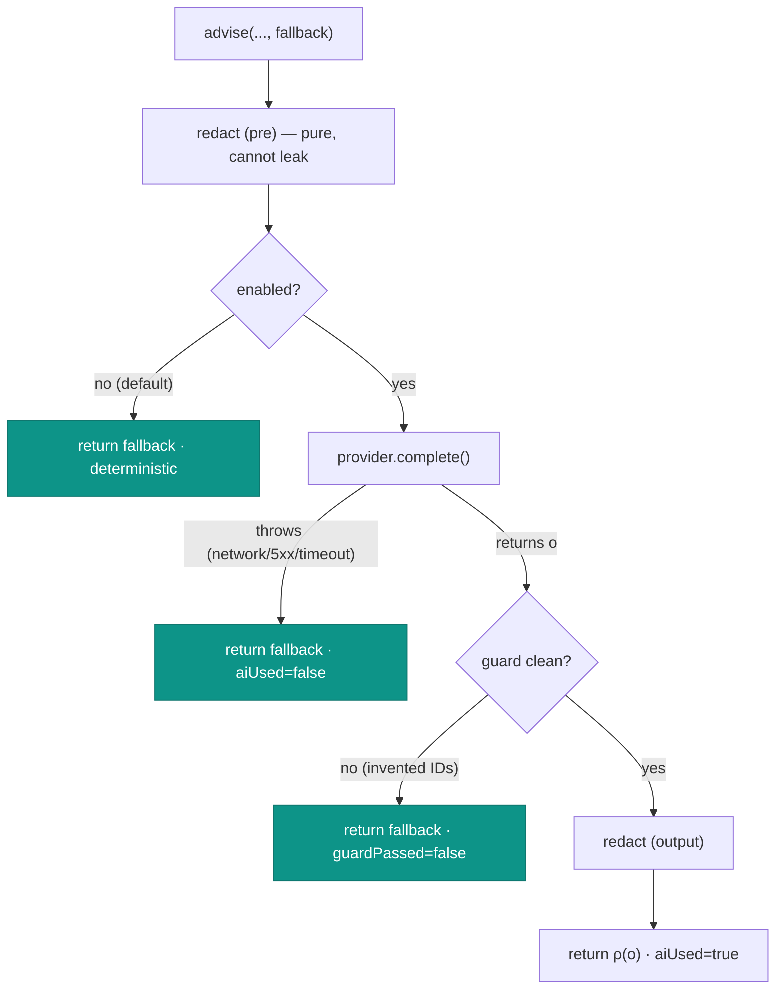

# Fail-safe & fallback

## Motivation

A governance component that *fails open* is worse than no component at all: it lulls you into trust and then,
at the worst moment, lets something through. `laravel-iam-ai` is built so that **every** failure mode of the
AI path degrades to the deterministic answer — never to an error surfaced at the user, and never to an "open"
state. This is the operational meaning of *"deterministic first, AI second."*

## Theory: a total function with a constant safe floor

Let the deterministic fallback be $f$. The advisory function is **total** — it returns an `Advisory` for every
input — and on every non-clean branch it returns exactly $f$:

$$
\text{advise}(\cdots, f) =
\begin{cases}
f & \text{AI disabled} \\
f & \text{transport throws} \\
f & \text{guard finds a violation} \\
\rho(o) & \text{clean model output}
\end{cases}
$$

The floor $f$ is **caller-supplied and mandatory** — there is no overload of `advise()` without it — so a safe
answer is always in hand *before* the model is consulted. The model can only *improve* on $f$; it can never
remove it.

## The failure modes



| Failure | Trigger | Result | Flags |
| --- | --- | --- | --- |
| **Disabled** | `enabled=false` (default) or misconfigured provider resolving to `DisabledProvider` | fallback | `aiUsed=false`, `provider=deterministic`/`disabled` |
| **Transport error** | provider `complete()` throws — network down, 5xx, timeout, bad config | fallback | `aiUsed=false`, `provider=<name>` |
| **Hallucination** | guard finds an identifier not in `allowedRefs` | fallback | `aiUsed=true`, `guardPassed=false`, `violations=[…]` |
| **Clean** | model returned, guard passed | redacted model output | `aiUsed=true`, `guardPassed=true` |

Note the **misconfiguration** case: if `IAM_AI_ENABLED=true` but no adapter is installed, the binding resolves
to `DisabledProvider`, whose `complete()` throws — which the client catches as a transport error and returns
the fallback. Turning the AI "on" without wiring a provider therefore fails **safe**, not open.

## Worked example: the network goes down mid-request

```php
config(['iam-ai.enabled' => true]);

// provider throws RuntimeException('network down')
$advisory = $client->advise('t', 'sys', 'explain', [], [], 'FALLBACK');

$advisory->text;    // 'FALLBACK'  — the user sees a real answer, not a 500
$advisory->aiUsed;  // false
// …and the event is still audited (stream=ai), so the outage is visible in the trail.
```

The caller does not need a `try/catch` around `advise()` for transport failures — the client already converts
them to the deterministic answer.

## ADR

::: collapsible "ADR-006 — Deterministic fallback is mandatory and total"
**Problem.** AI calls fail in many ways (disabled, network, hallucination). A governance layer must never
surface those as errors to the user or as an open authorization state.

**Decision.** Require a `deterministicFallback` on every `advise()` call. Make `advise()` total: every
non-clean branch returns the fallback; the only "better" outcome is a clean, guarded, redacted model output.
Catch *all* transport throwables. Resolve misconfiguration to the inert provider so "on without an adapter"
fails safe.

**Consequences.**
- ✅ No AI failure becomes a user-facing error or an open decision.
- ✅ Callers always get a usable answer and can ignore transport exceptions.
- ✅ Failures are still audited, so degradation is observable.
- ⚠️ The fallback's *quality* is the caller's responsibility — a weak fallback means weak answers when the AI
  is off. `AccessExplainer` builds a genuinely useful one from the PDP's `explanation[]`.
- ⚠️ Because failures are silent-by-fallback, monitor `ai_used` / `guard_passed` in the audit to notice an AI
  that's quietly always falling back.
:::

## Gotchas

::: callout warning
- **A weak fallback undermines the whole point.** The fallback is the floor; invest in it. The `AccessExplainer`
  composes `Accesso CONSENTITO/NEGATO (decision …) + explanation[]` so the deterministic answer is already
  informative.
- **"Always falling back" can hide a broken provider.** If `aiUsed` is always false with `enabled=true`, your
  adapter isn't bound or the transport is down — watch the audit, don't assume the model is running.
- **The guard's fallback is intentional, not a bug.** A `guardPassed=false` advisory returning deterministic
  text is the system working: the model invented an ID and was overruled.
:::

## See also

- [The advisory pipeline](/architecture/advisory-pipeline)
- [Sovereign by default](/concepts/sovereign-by-default)
- [Observability & audit](/operations/observability)
