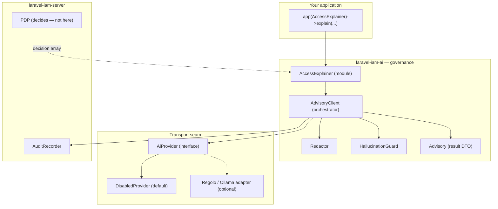
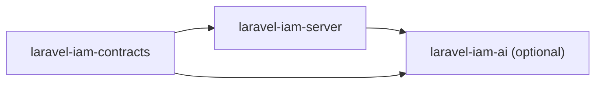

# Architecture overview

`laravel-iam-ai` is a thin **governance layer** that sits above an abstract AI transport and below your
application. Its whole job is to make the model *useful but harmless*: it never depends on a concrete
provider, never holds a decision, and never transmits an un-redacted prompt.

## The layers

## The pieces and where they live

| Component | Namespace | Responsibility |
| --- | --- | --- |
| `AdvisoryClient` | `Padosoft\Iam\Ai` | Orchestrates redact → transport → guard → audit; always returns an `Advisory` |
| `Advisory` | `Padosoft\Iam\Ai` | Immutable result: text, citations, governance flags |
| `AccessExplainer` | `Padosoft\Iam\Ai\Modules` | First module: rephrases a PDP decision; fail-closed |
| `Redactor` | `Padosoft\Iam\Ai\Governance` | Mandatory PRE-prompt + output redaction |
| `HallucinationGuard` | `Padosoft\Iam\Ai\Governance` | Rejects invented identifiers |
| `AiProvider` | `Padosoft\Iam\Ai\Contracts` | The transport interface |
| `DisabledProvider` | `Padosoft\Iam\Ai\Providers` | Inert default transport (throws → fallback) |
| `IamAiServiceProvider` | `Padosoft\Iam\Ai` | Wires the services; resolves the transport from config |

## Three seams, three guarantees

::: grids
::: grid
::: card "Transport seam → sovereignty" icon:plug
The module depends only on the `AiProvider` interface. The default binding is inert; sovereign adapters
rebind it. No provider lives in the core.

[Sovereign by default →](/concepts/sovereign-by-default)
:::
:::
::: grid
::: card "Result type → advisory-only" icon:file-check
The only output is `Advisory{ advisory_only: true }`. There is no verdict field for enforcement to read.

[Advisory-only →](/concepts/advisory-only)
:::
:::
::: grid
::: card "Pipeline order → fail-safe" icon:shield
Redaction precedes transmission; the guard follows the model; the deterministic fallback is always present.

[Fail-safe & fallback →](/architecture/fail-safe-and-fallback)
:::
:::
:::

## Dependency direction

`laravel-iam-ai` depends on `laravel-iam-server` (for the `AuditRecorder`) and `laravel-iam-contracts`, and is
**never** depended on by them. It is a *leaf*, optional module:

Removing the module removes AI assistance and nothing else — the PDP, the audit, and enforcement are entirely
in the server. This is what makes the AI *optional* in the strict sense: the platform is fully functional, and
fully secure, without it.

## Request lifecycle in one sentence

A caller hands a question plus **real evidence** and a **deterministic fallback** to the client; the client
redacts, optionally calls a sovereign model, guards the output against invented IDs, redacts again, audits the
governance metadata, and returns an `Advisory` — and the PDP, untouched, still decides what is enforced.

## See also

- [The advisory pipeline](/architecture/advisory-pipeline) — the stage-by-stage trace.
- [Fail-safe & fallback](/architecture/fail-safe-and-fallback) — every failure path.
- [Architecture decisions (ADR)](/architecture/decisions) — the consolidated rationale.
