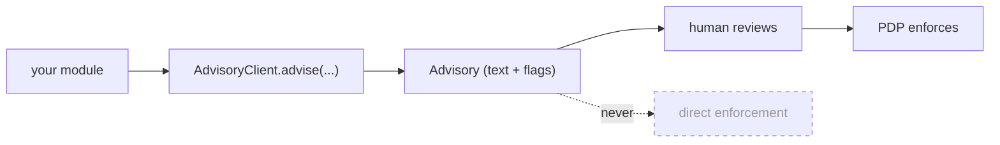

# Keep the AI out of the decision

The module is *built* so the AI can't decide — but you can still defeat that at the call site by mis-using the
output. These are the rules that keep the advisory layer advisory.

## Rule 1 — gate on the PDP, always

The only thing enforcement should read is `$pdp->check($query)->allowed`. The `Advisory` is for humans.

::: tabs
== tab "Do" icon:check
```php
if ($pdp->check($query)->allowed) {
    // enforce
}
$advisory = app(AccessExplainer::class)->explain($pdp->check($query)->toArray());
// show $advisory->text to the user — it does not gate anything
```
== tab "Don't" icon:x
```php
$advisory = app(AccessExplainer::class)->explain($decision);
if (str_contains($advisory->text, 'allowed')) {  // ❌ parsing prose for a verdict
    // enforce — WRONG: the model's wording is not an authorization signal
}
```
:::

## Rule 2 — never parse advisory text for a verdict

`Advisory::$text` is prose. It has no stable grammar, it's localized, and on a guard failure or transport error
it's the *fallback* string. Read structured truth from the PDP decision array, never from the sentence.

## Rule 3 — read the governance flags, don't infer them

| Question | Read this | Not this |
| --- | --- | --- |
| Was access allowed? | `$decision['allowed'] === true` | the advisory text |
| Did a model run? | `$advisory->aiUsed` | "the text looks AI-written" |
| Did the model invent IDs? | `$advisory->guardPassed === false` | eyeballing the citations |
| Was anything stripped? | `$advisory->redacted` | scanning for placeholders |

## Rule 4 — keep custom modules advisory

If you build your own module on `AdvisoryClient` (like [role drafting](/guides/draft-least-privilege-role)),
keep it advisory: return text + flags, never a boolean verdict derived from model output, and never apply a
change automatically. Route every action through a human + the PDP.



## Rule 5 — fail closed at the edges too

The module is fail-closed (a malformed decision reads as NEGATO; a transport failure falls back). Match that at
your call site: if you can't get a PDP decision, deny — don't show an advisory built from a guessed decision and
treat its optimistic tone as permission.

## Checklist

::: steps
1. **Enforcement reads only `$pdp->check()->allowed`.** Search your code for any branch that gates on an
   `Advisory`.
2. **No `str_contains`/regex on `$advisory->text`** feeding a permission check.
3. **Custom modules return advisories**, not verdicts; nothing auto-applies.
4. **Surprising NEGATO?** Verify `decision['allowed']` is a real boolean, not a string/missing key.
5. **Monitor `aiUsed`/`guardPassed`** in the audit to catch an AI that's silently always falling back.
:::

## See also

- [Advisory-only authorization](/concepts/advisory-only) — the structural guarantee behind these rules.
- [Audit & privacy](/concepts/audit-and-privacy) — the fail-closed verdict.
- [Fail-safe & fallback](/architecture/fail-safe-and-fallback)
