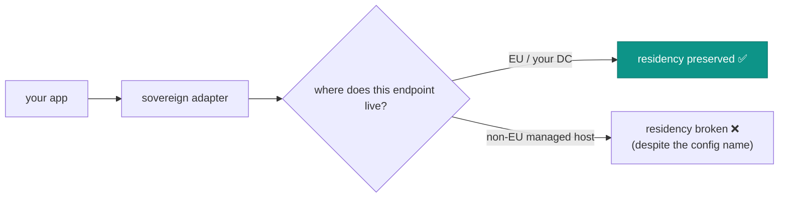

# Provider sovereignty & residency

The module's default sends nothing anywhere. The moment you enable a provider, **you** own the residency
guarantee. These practices keep AI assistance inside your boundary.

## Choose a genuinely sovereign transport

::: grids
::: grid
::: card "Regolo (EU)" icon:cloud
A sovereign Italian/EU inference provider. Data stays in an EU jurisdiction you can contract and audit. The
recommended hosted option for EU deployments.
:::
:::
::: grid
::: card "Ollama (on-prem)" icon:server
Runs entirely on infrastructure you control — the data never leaves your perimeter. The strongest residency
guarantee, at the cost of running the model yourself.
:::
:::
::: grid
::: card "OpenAI / non-EU" icon:ban
Never a default, and not recommended for IAM metadata in an EU context. If you must, treat it as a deliberate,
documented exception with legal sign-off — not a convenience.
:::
:::
:::

## Audit your actual topology

"On-prem" is a property of *where the bytes go*, not of the word in your config. A sovereign-looking adapter
pointed at a managed box in another jurisdiction is not sovereign.



Trace the endpoint your adapter calls to a real region. Verify TLS terminates where you think it does. Confirm
the provider's retention and training policy in writing.

## Keep defense-in-depth even with a sovereign provider

A sovereign provider is *your* boundary, but its logs are still outside your application. So:

- **Leave redaction on.** It's mandatory anyway, and it assumes the provider's logs are not yours to control.
  → [PRE-prompt redaction](/concepts/redaction)
- **Keep `store_prompts=false`.** Don't reintroduce on your side what redaction removed on the wire.
- **Bound `store_outputs` retention.** If you enable it, the (sanitized) outputs live in your audit — apply the
  same retention you give the rest of the tamper-evident trail.

## Verify the transport is actually live

A common silent failure: `IAM_AI_ENABLED=true` but no adapter bound (or the wrong provider string), so every
call quietly falls back to deterministic text.

```php
$advisory = app(AccessExplainer::class)->explain($decision, 'Why?');

$advisory->aiUsed;   // expect true if you enabled a provider; false ⇒ not live
$advisory->provider; // 'regolo' / 'ollama' / your name ⇒ live; 'deterministic'/'disabled' ⇒ not
```

Watch `ai_used` and `provider` in the audit stream to confirm the model is genuinely being used — and to catch
an outage that's silently degrading to fallback.

## ADR

::: collapsible "ADR — residency is the operator's guarantee once enabled"
**Problem.** The module can route to any `AiProvider`; the residency guarantee depends on the operator's choice
and topology, which the module can't verify.

**Decision.** Default to no transport; recommend Regolo (EU) / Ollama (on-prem); keep redaction mandatory even
with a sovereign provider; surface `provider`/`aiUsed` so operators can verify what's actually running.

**Consequences.** The safe state needs no decision ✅ · enabling AI is an explicit residency choice ✅ ·
defense-in-depth survives a sovereign provider ✅ · the module cannot attest a vendor's jurisdiction — that's
the operator's diligence ⚠️.
:::

## Checklist

::: steps
1. **Pick Regolo (EU) or Ollama (on-prem).** Document any non-EU exception with sign-off.
2. **Trace the endpoint** to a real region; verify retention/training policy in writing.
3. **Leave redaction on**, keep `store_prompts=false`, bound `store_outputs` retention.
4. **Confirm `aiUsed`/`provider`** on a live call and in the audit.
5. **Alert on silent fallback** — `enabled=true` but `aiUsed` always false means the transport isn't live.
:::

## See also

- [Sovereign by default](/concepts/sovereign-by-default)
- [Write a sovereign provider](/guides/write-a-provider-adapter)
- [Observability & audit](/operations/observability)
