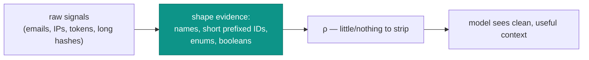

# Tuning redaction

Redaction is mandatory and deterministic — there's no per-pattern config to turn knobs on. "Tuning" here means
**working with** the pipeline so it protects you without mangling the references you actually need.

## Know what it catches

The `Redactor` over-approximates secrets, by design ([why](/concepts/redaction)):

| You pass | What happens |
| --- | --- |
| `Bearer …`, `Basic …`, `eyJ…` (JWT) | redacted to `[REDACTED_AUTH]` / `[REDACTED_JWT]` |
| `password = …`, `secret = …`, `token = …` (to end of line) | value replaced with `[REDACTED]` |
| email, IPv4 | `[REDACTED_EMAIL]` / `[REDACTED_IP]` |
| 32+ char hex, 40+ char base64 | `[REDACTED_HEX]` / `[REDACTED_B64]` |
| `warehouse:stock_operator`, `orders:refund`, short prefixed IDs | **untouched** — these are safe references |

## Handle over-redaction of identifiers you need

The classic surprise: a long opaque identifier you *wanted* the model to cite (a 40-char content hash, a long
base64 token-id) gets replaced — and now the model can't reference it.

::: callout tip "Pass a short, guarded reference instead of the raw blob"
Don't put a 40+ char raw token into evidence. Put a **short prefixed identifier** (e.g. `grn_01H…`) in both the
evidence and `allowedRefs`. It survives redaction *and* the hallucination-guard recognizes it. Reserve the raw
blob for systems that need it, not for the prompt.
:::

```php
// ❌ raw blob → redacted to [REDACTED_HEX]/[REDACTED_B64], model can't cite it
$evidence = ['grant' => 'a1b2c3d4e5f6...40+hex...'];

// ✅ short prefixed id → survives redaction, recognized by the guard
$evidence    = ['grant_id' => 'grn_01Hexcept'];
$allowedRefs = ['grn_01Hexcept'];
```

## Keep evidence redaction-friendly



- **Prefer structured fields with short IDs** over free-text blobs.
- **Strip obvious PII upstream** when you build evidence — redaction is a floor, not your only DLP.
- **Use enums/booleans** for state (`status: 'denied'`, `mfa: false`) instead of prose that might embed a
  secret.

## Verify with `didRedact`

When you're unsure whether something is being stripped, check the flag:

```php
$r = new Redactor;
$out = $r->redact($yourEvidenceAsText);

$r->didRedact; // true ⇒ something matched — inspect $out to see if it was a needed reference
```

Inside the pipeline, the same signal surfaces as `Advisory::$redacted` and the audit's `redacted` flag.

## Never disable it

There is no supported "off" switch in the shipped flow — `redaction` defaults to `true` and the `AdvisoryClient`
calls the redactor unconditionally. That's deliberate:

::: callout danger "Redaction is not a performance knob"
Disabling redaction means shipping raw prompts (tokens, keys, emails, IPs) to a provider whose logs you don't
control. Even with a sovereign provider, those logs are outside your application. Leave it on.
:::

## Checklist

::: steps
1. **Shape evidence as structured fields** with short prefixed IDs, not raw blobs.
2. **Put cite-able references in `allowedRefs`** in a guard-recognized format.
3. **Strip PII upstream** as well — redaction is a floor.
4. **Check `redacted`/`didRedact`** when a worked advisory looks oddly generic.
5. **Never disable redaction**, even with a sovereign provider.
:::

## See also

- [PRE-prompt redaction](/concepts/redaction) — the full pattern list and theory.
- [The hallucination guard](/concepts/hallucination-guard) — why short prefixed IDs are ideal references.
- [Provider sovereignty & residency](/best-practices/provider-sovereignty)
