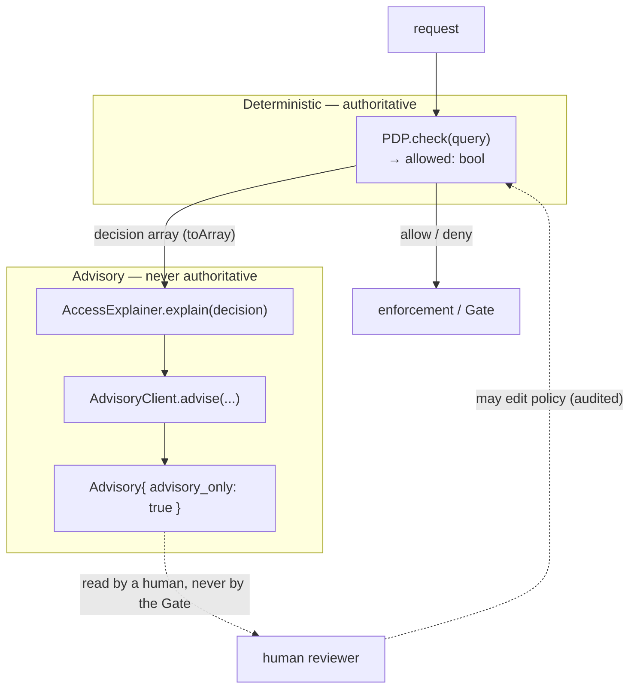

# Advisory-only authorization

## Motivation

The single most dangerous failure mode of "LLM + access control" is **decision capture**: a model emits text
that *reads like* a verdict ("the user should have access"), a developer threads it into an authorization
path, and now a stochastic, promptable, hallucination-prone system gates real resources. No amount of prompt
engineering makes that safe, because the unsafe property is *architectural*, not textual.

`laravel-iam-ai` removes the capability rather than discouraging its use. The AI is confined to an **advisory
role**: it produces explanations and drafts that a human reviews and that the deterministic **Policy Decision
Point (PDP)** still adjudicates.

## Theory: two functions, one of which is authoritative

Model the system as two functions over a request $r$ and evidence $E$.

The **decision function** is deterministic and lives entirely in `laravel-iam-server`:

$$
\text{PDP} : r \mapsto \{\,\text{allow},\ \text{deny}\,\}
$$

The **advisory function** is non-deterministic and lives here:

$$
\text{Advise} : (r, E) \mapsto a \in \mathcal{A}
$$

where every $a$ is an `Advisory` carrying `advisory_only = true`. The safety invariant is that the set of
**enforced** outcomes depends only on the PDP:

$$
\text{enforce}(r) = \text{PDP}(r) \quad\text{for all advisories } a.
$$

In words: **no advisory ever changes what is enforced.** `Advise` may *inform* a human who then changes a
policy that `PDP` later reads — but that is a deliberate, audited, human-in-the-loop edit, not the AI
deciding.

## Design: the advisory layer sits beside the decision, never inside it



The arrow that does **not** exist is the important one: there is no edge from `Advisory` to `enforcement`.

## How it is enforced structurally

The design makes decision capture hard to write by accident:

- **The output type is named `Advisory`.** It has no `allowed`/`granted` boolean to misread. The only
  boolean-ish surface is governance metadata (`guardPassed`, `aiUsed`), never a verdict.
- **`toArray()` always injects `advisory_only => true`.** Any serialized advisory self-labels.
- **`AccessExplainer` is fail-closed.** It *describes* a decision the PDP already made; it derives its
  verdict text from `decision['allowed'] === true` (a strict boolean check — see
  [Audit & privacy](/concepts/audit-and-privacy) and the [guide](/guides/explain-a-denial)), never from the
  model.
- **The deterministic fallback is always present.** Every `advise()` call requires a
  `deterministicFallback` string, so there is always a non-AI answer to return.

## ADR

::: collapsible "ADR-001 — Advisory-only, enforced by type and pipeline"
**Problem.** LLM output is useful for explanation and drafting but unsafe as an authorization signal. How do
we ship the useful half without ever letting the model gate access?

**Decision.** Confine the AI to an advisory layer that runs *beside* the PDP, never inside it. The only
output type is `Advisory`, which carries `advisory_only = true` and no verdict field. Authorization remains a
pure function of the deterministic PDP. Concrete modules (`AccessExplainer`) *explain* decisions the PDP
already made and are fail-closed.

**Consequences.**
- ✅ Decision capture becomes something you have to write *on purpose* and against the grain of the types.
- ✅ The AI can be disabled, fail, or hallucinate with zero impact on what is enforced.
- ✅ Humans can still act on advice — by editing policy the PDP later reads, with full audit.
- ⚠️ The module cannot "auto-remediate" access; that is by design. Suggestions need a human + the PDP.
- ⚠️ Callers must still call the PDP for enforcement; the advisory text is never a substitute.
:::

## Worked example: a denial that the model "disagrees" with

```php
$decision = $pdp->check($query)->toArray(); // allowed = false

$advisory = app(AccessExplainer::class)->explain($decision, 'Why was this denied?');

// Even if a misbehaving model wrote "this should clearly be allowed",
// nothing downstream treats that as an allow:
$advisory->toArray()['advisory_only']; // true
$pdp->check($query)->allowed;          // still false — the only thing enforcement reads
```

The advisory can be shown to a support agent verbatim; it cannot flip the gate.

## Gotchas

::: callout warning
- The advisory `text` is *prose*, not a contract. Never parse it for an allow/deny signal — read the PDP.
- A clean `guardPassed = true` means the model didn't invent identifiers; it does **not** mean the model's
  reasoning is correct. Advisories are aids for humans, not proofs.
- If you build your own module on `AdvisoryClient`, keep it advisory: don't return a boolean verdict derived
  from model text.
:::

## See also

- [Keep the AI out of the decision](/best-practices/keep-ai-out-of-decisions)
- [The advisory pipeline](/architecture/advisory-pipeline)
- [Architecture decisions (ADR)](/architecture/decisions)
