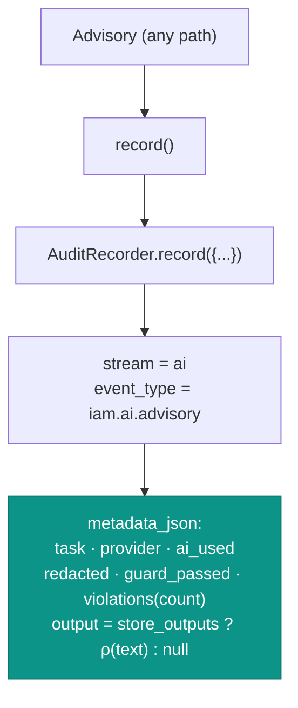

# Audit & privacy

## Motivation

If an AI touches access governance, "what did it do, on what, and was anything sensitive involved?" must be
answerable — without the audit trail itself becoming a secret store. `laravel-iam-ai` resolves that tension
with **privacy-by-default audit**: every action is recorded, but prompts are *never* persisted and outputs
are persisted only when you opt in, and only after sanitization.

## Theory: log the act, not the secret

For each advisory the module records a tuple of **governance metadata** $g$, never the raw prompt $u$:

$$
\text{audit} = \langle\, \text{task},\ \text{provider},\ \text{ai\_used},\ \text{redacted},\ \text{guard\_passed},\ |V|,\ \text{output}^{?}\,\rangle
$$

where $\text{output}^{?}$ is present only if `store_outputs = true`, and then it is the **redacted** output
$\rho(o)$, never the raw one. The prompt $u$ appears in **no** branch — `store_prompts = false` is a hard
default with no env override in the shipped config.

## Design: audit on every path

Every `advise()` outcome — AI off, transport threw, guard failed, or clean success — flows through one
`record()` call before returning. There is no path that returns an `Advisory` without auditing it.



The recorded fields are exactly:

| Field | Source | Note |
| --- | --- | --- |
| `stream` | constant | `ai` |
| `event_type` | constant | `iam.ai.advisory` |
| `task` | caller | e.g. `access_explain` |
| `provider` | `Advisory::$provider` | `deterministic` / `regolo` / `ollama` / … |
| `ai_used` | `Advisory::$aiUsed` | did a model actually run? |
| `redacted` | `Advisory::$redacted` | did redaction fire on input or output? |
| `guard_passed` | `Advisory::$guardPassed` | did the hallucination-guard approve? |
| `violations` | `count(Advisory::$violations)` | a **count**, not the IDs — no evidence leakage |
| `output` | `store_outputs ? text : null` | only the **sanitized** text, opt-in |

The recorder is `Padosoft\Iam\Domain\Audit\Pii\AuditRecorder` from `laravel-iam-server`, so AI actions land in
the same tamper-evident audit stream as the rest of IAM — see
[tamper-evident audit](https://doc.laravel-iam-server.padosoft.com/concepts/tamper-evident-audit).

## Fail-closed explanation

Privacy isn't the only fail-safe in this area. `AccessExplainer` derives its verdict from a **strict boolean**
check, never from truthiness or model text:

```php
$allowed = ($decision['allowed'] ?? false) === true;
$verdict = $allowed ? 'CONSENTITO' : 'NEGATO';
```

A string `"false"` (truthy in PHP), a missing key, or any unexpected value all collapse to **NEGATO** — the
explanation never spuriously reads as *allowed*. This mirrors the PDP's own deny-overrides / fail-closed
posture.

## Worked example: reading the trail

```php
use Padosoft\Iam\Domain\Audit\Models\AuditEvent;

// after an advisory ran
$event = AuditEvent::query()
    ->where('event_type', 'iam.ai.advisory')
    ->latest()->first();

$event->metadata_json['ai_used'];      // false  (AI was off → deterministic)
$event->metadata_json['redacted'];     // true   (something was stripped)
$event->metadata_json['guard_passed']; // true
$event->metadata_json['violations'];   // 0
$event->metadata_json['output'];       // null   (store_outputs = false)
```

You can answer "did the AI run? was anything redacted? did the guard reject anything?" entirely from
metadata, with no secret ever written.

## ADR

::: collapsible "ADR-005 — Audit every action; store the act, not the secret"
**Problem.** AI governance needs an audit trail, but the trail must not become a place where prompts and
secrets accumulate.

**Decision.** Record every advisory on every path under `stream=ai` / `iam.ai.advisory` with governance
metadata. Never store prompts (`store_prompts=false`, hard default). Store outputs only when
`store_outputs=true`, and then only the redacted text. Record `violations` as a count, not as identifiers.
Make `AccessExplainer` fail-closed on a strict boolean.

**Consequences.**
- ✅ Full observability of AI actions without a secret-bearing log.
- ✅ The decision to retain outputs is explicit, opt-in, and still sanitized.
- ✅ AI actions share the server's tamper-evident audit stream.
- ⚠️ Because prompts aren't stored, you can't "replay" exactly what a model saw — by design. Reproduce from
  the inputs, not the trail.
- ⚠️ `store_outputs=true` persists model text (redacted) — treat that store with the same care as any audit
  log and keep retention bounded.
:::

## Gotchas

::: callout warning
- **`violations` in the audit is a count.** To see *which* IDs were invented, inspect the returned `Advisory`
  at call time — they're not written to the trail (that would store fabricated evidence).
- **`store_outputs=true` still audits sanitized text only.** It is not a way to recover raw prompts; those are
  never written.
- **Fail-closed means a malformed decision reads as NEGATO.** If an explanation surprisingly says denied,
  check that `decision['allowed']` is a real boolean `true`, not a string or a missing key.
:::

## See also

- [PRE-prompt redaction](/concepts/redaction)
- [Observability & audit](/operations/observability)
- [The advisory pipeline](/architecture/advisory-pipeline)
