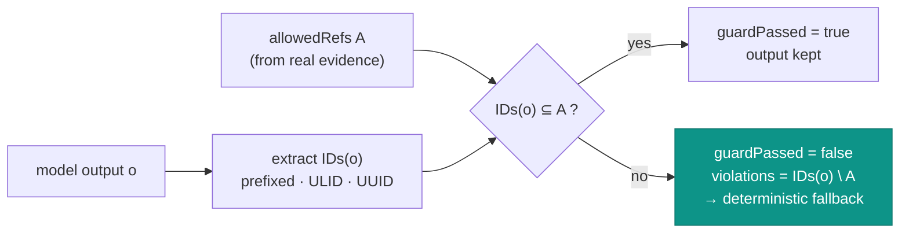

# The hallucination guard

## Motivation

A model asked to explain an access decision will happily *invent* a `decision_id`, a grant key, or an event
reference to make its narrative sound authoritative. In an IAM context that is poison: a fabricated
`grn_…` in an explanation looks exactly like real evidence to a support agent, and "the AI cited a grant" can
become "the AI proved access should exist." The guard exists to make **invented evidence a detectable,
rejectable event**, not a convincing sentence.

`Padosoft\Iam\Ai\Governance\HallucinationGuard` enforces a simple, strong rule: the output may cite **only**
identifiers that were in the evidence the tools provided.

## Theory: a whitelist over an identifier grammar

Let $\text{IDs}(o)$ be the set of identifier-shaped tokens the model emitted in output $o$, and let $A$ be the
`allowedRefs` — the identifiers drawn from real evidence. The guard computes the **violation set**:

$$
V(o, A) = \text{IDs}(o) \setminus A.
$$

The advisory is trustworthy iff $V = \varnothing$:

$$
\text{passes}(o, A) \iff V(o, A) = \varnothing.
$$

This is a *whitelist*, not a blacklist: anything that *looks like* an internal identifier but isn't in $A$ is
a violation. The model cannot smuggle a fabricated ID past the guard by formatting it correctly — formatting
it correctly is exactly what gets it caught.

$\text{IDs}(o)$ is defined by an identifier grammar of three recognizers, chosen so a model can't dodge the
check by switching ID style:

| Recognizer | Shape | Example |
| --- | --- | --- |
| Prefixed ref | `prefix` (2–12 chars) + `_`/`-` separator + ≥8 alphanumerics | `dec_01H…`, `grn_XYZ98765`, `campaign_01ARYZ6S41`, `decision-99887766AB` |
| Bare ULID | 26-char Crockford base32 | `01ARYZ6S41…` |
| UUID | standard 8-4-4-4-12 hex | `550e8400-e29b-41d4-a716-446655440000` |

The prefix accepts up to 12 characters and both `_` and `-` separators, so longer or hyphenated ID schemes
(`campaign_…`, `decision-…`) are covered too — a narrow recognizer would leave a bypass.

## Design: where the guard sits



In the `AdvisoryClient`, a non-empty violation set means the model's output is **discarded**: the client
returns the `deterministicFallback`, sets `aiUsed = true` (the model *did* run), `guardPassed = false`, and
records the offending identifiers in `violations`. The fabricated text never reaches the user.

## Worked example

```php
$g = new HallucinationGuard;

// Real evidence had dec_REALE01 only; the model also cited grn_INVENTATO99.
$v = $g->violations('See dec_REALE01 but also grn_INVENTATO99', ['dec_REALE01']);
// $v === ['grn_INVENTATO99']   → guardPassed would be false

$g->passes('Granted by dec_ABC12345 via grn_XYZ98765', ['dec_ABC12345', 'grn_XYZ98765']); // true

// It also catches an invented UUID, not just our prefixed IDs:
$g->violations("Because of event 550e8400-e29b-41d4-a716-446655440000.", []);
// ['550e8400-e29b-41d4-a716-446655440000']
```

Inside the pipeline, a violation is invisible to the end user — they simply get the deterministic answer:

```php
config(['iam-ai.enabled' => true]);
$advisory = $client->advise('t', 'sys', 'explain', [], ['dec_OK000001'], 'SAFE FALLBACK');
// model returned "...because of grn_INVENTATO9999."
$advisory->guardPassed; // false
$advisory->violations;  // ['grn_INVENTATO9999']
$advisory->text;        // 'SAFE FALLBACK'  — the invented text is never shown
```

## ADR

::: collapsible "ADR-004 — Whitelist guard over an identifier grammar; violation ⇒ deterministic fallback"
**Problem.** Models fabricate IDs that look authoritative. Showing a fabricated `decision_id`/grant in an IAM
explanation is dangerous and erodes trust.

**Decision.** After the model returns, extract all identifier-shaped tokens via three recognizers (prefixed,
ULID, UUID) and reject any not present in `allowedRefs` derived from real evidence. A non-empty violation set
discards the model output and returns the deterministic fallback, flagging `guardPassed = false` and recording
the violations for audit.

**Consequences.**
- ✅ The model cannot present invented evidence to a human — correct formatting is what flags it.
- ✅ Violations are observable (counted in the audit), not silent.
- ✅ The recognizer set covers prefixed IDs, bare ULIDs, and UUIDs, closing obvious bypasses.
- ⚠️ The guard checks *identifiers*, not *claims*: a model can still write a wrong sentence using only real
  IDs. It bounds fabrication of evidence, not reasoning quality.
- ⚠️ Identifier formats outside the three recognizers (e.g. plain integer IDs) are not guarded — keep
  internal references in a recognized format, or treat such advisories as lower-trust.
:::

## Gotchas

::: callout warning
- **Plain numeric IDs aren't caught.** The guard recognizes prefixed/ULID/UUID shapes. If your evidence uses
  bare integers as identifiers, the model could "invent" one undetected — prefer prefixed IDs in evidence.
- **`allowedRefs` must be populated from *real* evidence.** Passing an empty `allowedRefs` means *every*
  identifier-shaped token in the output is a violation; passing too-broad refs weakens the guard. The
  `AccessExplainer` derives them from the `decision_id` and matched keys for you.
- **It's not a fact-checker.** `guardPassed = true` says "no invented IDs," not "the explanation is correct."
:::

## See also

- [Advisory-only authorization](/concepts/advisory-only)
- [The advisory pipeline](/architecture/advisory-pipeline)
- [Explain a denial](/guides/explain-a-denial)
