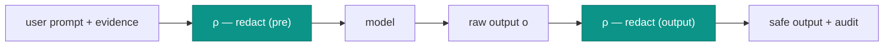

# PRE-prompt redaction

## Motivation

A prompt is an exfiltration channel. The moment you interpolate "context" into a model call, you risk shipping
a Bearer token, a private key, a customer email, or an internal IP to a provider whose logs you don't control.
The fix cannot be "remember to sanitize" — it has to be a **mandatory** stage that runs **before** the prompt
is ever assembled, and **again** on the output as defense-in-depth.

`Padosoft\Iam\Ai\Governance\Redactor` is that stage: deterministic, regex-based, fail-safe, and on the
critical path of every AI call.

## Theory: redact-before-transmit, and redact-again

Let $u$ be the user prompt and $E$ the evidence. The `AdvisoryClient` never transmits $u$ or $E$ — it
transmits $\rho(u)$ and $\rho(E)$, where $\rho$ is the redaction function. After the model returns $o$, it
returns and audits $\rho(o)$, not $o$:

$$
\text{send} = \rho(u) \,\Vert\, \rho(E), \qquad \text{return} = \rho(o).
$$

The fail-safe principle makes $\rho$ a **conservative over-approximation**: when a token *might* be a secret,
it is redacted. The cost of a false positive is a slightly less rich prompt; the cost of a false negative is a
leak. The asymmetry dictates the bias.



## Model: what gets redacted

The `Redactor` applies an ordered list of patterns, each replacing a match with a typed placeholder:

| Class | Matches | Placeholder |
| --- | --- | --- |
| Auth tokens | `Bearer …` / `Basic …` | `[REDACTED_AUTH]` |
| JWT | `eyJ…` (header.payload prefix) | `[REDACTED_JWT]` |
| Private keys | `-----BEGIN … PRIVATE KEY----- … END … -----` | `[REDACTED_PRIVATE_KEY]` |
| Keyed secrets | `password\|passwd\|secret\|client_secret\|api_key\|token\|otp\|recovery_code\|cookie\|set-cookie\|session_id = value` (to end of line) | `<key>=[REDACTED]` |
| Email | `local@domain.tld` | `[REDACTED_EMAIL]` |
| IPv4 | dotted-quad addresses | `[REDACTED_IP]` |
| Long hex | `[A-Fa-f0-9]{32,}` (raw keys / hashes) | `[REDACTED_HEX]` |
| Base64 blob | `[A-Za-z0-9+/]{40,}={0,2}` (opaque tokens) | `[REDACTED_B64]` |

Two design details that matter:

- **Keyed secrets are stripped to end-of-line.** A secret value with spaces (`secret = a long pass phrase`)
  would otherwise leak its tail; matching to `\n` removes the whole value while preserving following lines.
- **Hex is matched before base64.** A 64-character hex string is also valid base64; redacting hex first
  yields the more specific `[REDACTED_HEX]` placeholder instead of fragmenting it.

`redactArray()` walks evidence structures recursively, redacting string **values** while **preserving keys**
(keys are field names, not secrets) and leaving non-strings untouched.

## The `didRedact` signal

The `Redactor` exposes a public `bool $didRedact` set to `true` whenever any pattern fired. The
`AdvisoryClient` **resets it per call** (the redactor instance can be shared/singleton), runs redaction, and
records the flag on the `Advisory` as `redacted`. That flag flows into the audit trail so you can answer "was
anything stripped from this interaction?" without ever storing the secret itself.

```php
$r = new Redactor;
$out = $r->redact('Authorization: Bearer abc.def.ghi and password=Sup3rSecret for mario@acme.it from 10.0.0.5');
// $out contains no 'Bearer abc', 'Sup3rSecret', 'mario@acme.it', or '10.0.0.5'
$r->didRedact; // true

$clean = (new Redactor)->redact('Mario has the role warehouse:stock_operator.');
// unchanged; didRedact === false
```

## ADR

::: collapsible "ADR-003 — Mandatory, fail-safe redaction on input and output"
**Problem.** Prompts and model outputs can carry secrets/PII to a provider whose logs you don't control.
Optional, best-effort sanitization is forgotten exactly when it matters.

**Decision.** Make redaction a mandatory stage of `AdvisoryClient`, run on the input *before* transmission
and again on the output *before* return/audit. Use a deterministic, ordered regex pipeline biased toward
over-redaction (fail-safe). Surface a `didRedact` signal for audit; never store the original.

**Consequences.**
- ✅ No AI call can transmit an un-redacted prompt — it isn't a code path.
- ✅ A leak in the model's output is caught on the way back (defense-in-depth).
- ✅ The audit trail records *that* redaction happened without storing the secret.
- ⚠️ Regex redaction is an over-approximation: it can mangle innocent long hex/base64 (e.g. a content hash
  you *wanted* the model to see) and cannot catch novel secret formats it has no pattern for.
- ⚠️ It is not a DLP product. Treat it as a strong floor, not a complete guarantee — keep sovereign transport.
:::

## Worked example: redaction inside the pipeline

```php
config(['iam-ai.enabled' => true]);

$advisory = $client->advise(
    task: 'explain',
    system: 'You are a security assistant.',
    userPrompt: 'token=Bearer abc.def.ghi — why was this denied?',
    evidence: ['note' => 'user mario@acme.it from 10.0.0.5'],
    allowedRefs: [],
    deterministicFallback: 'Access denied.'
);

// The provider received a prompt with no 'abc.def.ghi', no email, no IP.
$advisory->redacted; // true
```

## Gotchas

::: callout warning
- **Over-redaction is real.** A 40+ char base64 blob or a 32+ char hex you legitimately wanted in the prompt
  (e.g. a public content hash) will be replaced. If a worked advisory looks oddly generic, check whether a
  needed identifier was redacted, and pass it through `allowedRefs`/evidence as a shorter reference instead.
- **New formats slip through.** The pipeline catches the listed classes; an exotic credential format with no
  pattern is not redacted. Don't rely on it as your only control — keep the transport sovereign.
- **Reset matters.** If you call the `Redactor` directly and reuse the instance, reset `didRedact` yourself;
  the `AdvisoryClient` already does this per call.
:::

## See also

- [Tuning redaction](/best-practices/redaction-tuning)
- [The advisory pipeline](/architecture/advisory-pipeline)
- [Audit & privacy](/concepts/audit-and-privacy)
