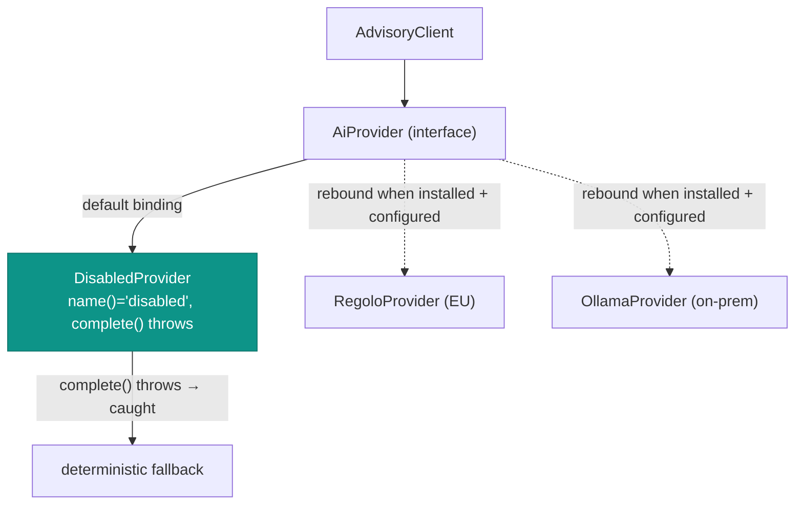

# Sovereign by default

## Motivation

An IAM system handles the most sensitive metadata in your stack: who can do what, why a request was denied,
which grants exist. The moment any of that crosses into a third-party model API, it becomes someone else's
log line — subject to their jurisdiction, retention, and training policies. For European deployments this is
not a preference; it is a **GDPR and data-residency** constraint.

So the module's default is not "pick a good provider" — it is **send nothing anywhere**. Sovereignty is a
property of the *default state*, not a configuration you remember to set.

## Theory: sovereignty as the initial state

Let $D$ be the set of data-handling locations reachable by the module and $S \subseteq D$ the **sovereign**
subset (under your control: in-process, on-prem, or an EU provider you contract with). The module guarantees:

$$
\text{enabled} = \text{false} \ \Longrightarrow\ \text{reachable}(D) = \{\,\text{in-process}\,\} \subseteq S
$$

Out of the box `enabled = false` **and** `provider = 'disabled'`, so the reachable set is exactly the local
process. Enabling the module can only *expand* the reachable set to a provider **you** choose — and the
recommended choices keep $\text{reachable}(D) \subseteq S$:

- **Regolo** — a sovereign Italian/EU inference provider.
- **Ollama** — fully on-prem; the data never leaves your perimeter.

There is no default that puts a non-sovereign endpoint in $D$. **OpenAI is never wired as a default**, and no
AI SDK is pulled in via `require`.

## Design: the transport seam

The core depends only on an abstract `AiProvider` contract. Concrete transports are **optional adapter
packages** that rebind it.



`IamAiServiceProvider` resolves the binding from `config('iam-ai.provider')`. With nothing installed and
nothing configured, the `match` falls through to `DisabledProvider`, whose `complete()` throws — and the
`AdvisoryClient` treats *any* transport failure as a reason to return the deterministic answer. Misconfiguring
the module therefore fails **safe**, not open.

## Model: the provider lifecycle

| State | `enabled` | `provider` | Adapter installed | Reachable data |
| --- | --- | --- | --- | --- |
| Default (out of the box) | `false` | `disabled` | — | in-process only |
| Misconfigured (enabled, no adapter) | `true` | `regolo` | no | in-process only — `DisabledProvider` throws → fallback |
| On-prem | `true` | `ollama` | yes | your Ollama host |
| Sovereign EU | `true` | `regolo` | yes | Regolo (EU) |

There is no row whose "reachable data" column is a non-sovereign third party by default — you would have to
install and configure such an adapter deliberately.

## ADR

::: collapsible "ADR-002 — Sovereign and off by default; no provider in the core"
**Problem.** Sensitive IAM metadata must not leak to non-sovereign model APIs, and an EU-first product cannot
ship a default that sends data to a US provider.

**Decision.** Ship `enabled = false` and `provider = 'disabled'`. Depend only on the `AiProvider` interface;
keep all concrete transports in optional adapter packages. Recommend Regolo (EU) and Ollama (on-prem).
Never add an AI SDK to `require`. Resolve an unknown/uninstalled provider to `DisabledProvider`, which throws
and triggers the deterministic fallback.

**Consequences.**
- ✅ Data residency is the *default*, not an opt-in checkbox someone forgets.
- ✅ Installing the package adds no network egress and no third-party SDK.
- ✅ Enabling the AI is an explicit, auditable decision with a sovereign provider.
- ⚠️ You must install an adapter to get AI assistance — there is no "just works with OpenAI" path, on purpose.
- ⚠️ Provider sovereignty is your responsibility once you contract one; the module routes, it cannot vouch for
  a vendor's jurisdiction.
:::

## Worked example: enabling Ollama on-prem

```dotenv
IAM_AI_ENABLED=true
IAM_AI_PROVIDER=ollama
IAM_AI_MODEL=llama3.1
```

```bash
# install the matching transport adapter; point it at your local Ollama
composer require padosoft/laravel-ai-ollama   # example adapter
```

The adapter rebinds `AiProvider`. Redaction still runs PRE-prompt, the guard still runs on the output, and
every call is still audited — sovereignty doesn't switch governance off.

## Gotchas

::: callout warning
- Setting `IAM_AI_PROVIDER=regolo` **without** installing the adapter leaves the binding on
  `DisabledProvider` — you'll silently get deterministic answers (`aiUsed = false`). Check `aiUsed` /
  `provider` on the `Advisory` if you expected the model to run.
- "On-prem" means *your* Ollama host. If that host is itself a managed cloud box in another jurisdiction, you
  haven't actually kept data sovereign — audit your topology.
- Sovereignty is about the *transport*, not the prompt content. Redaction still matters even with a
  sovereign provider; defense-in-depth assumes the provider's logs are out of your control.
:::

## See also

- [Provider sovereignty & residency](/best-practices/provider-sovereignty)
- [Write a sovereign provider](/guides/write-a-provider-adapter)
- [Configuration](/operations/configuration)
