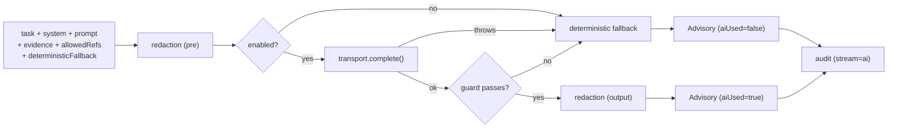

# Core concepts

LLMs are great at *explaining* and *drafting*, and terrible at being *trusted*. Wire one into an IAM system
naively and three things go wrong:

1. It **hallucinates** — citing a `decision_id` or grant that never existed.
2. It **leaks** — your prompt carries a Bearer token, a private key, an email, and now so do the provider's
   logs.
3. It **decides** — a developer reads "the user should have access" and ships it as an authorization path.

`laravel-iam-ai` treats the model as an **untrusted advisor behind a governance gate**. This page is the map;
each concept has its own deep page.

## The mental model

Everything flows through one pipeline, wrapped in *"deterministic first, AI second"*:



There is no path where the model's word becomes the decision. If the AI is off, the transport throws, or the
guard rejects the output, you get the deterministic answer built from your tools.

::: callout danger "The AI never decides"
Authorization lives entirely in the PDP (`laravel-iam-server`). This module only ever returns an `Advisory`
— a proposal flagged `advisory_only`. A human, or the PDP, acts on it.
:::

## The five entities

::: grids
::: grid
::: card "AdvisoryClient" icon:workflow
The orchestrator. Resets the redactor, redacts the prompt and evidence, calls the transport, runs the
guard, redacts the output again, audits — and returns an `Advisory` on **every** path.

[Pipeline →](/architecture/advisory-pipeline)
:::
:::
::: grid
::: card "Redactor" icon:shield
Deterministic, mandatory, fail-safe. Runs **before** the prompt leaves and **again** on the output
(defense-in-depth). Tracks whether it touched anything via `didRedact`.

[Redaction →](/concepts/redaction)
:::
:::
::: grid
::: card "HallucinationGuard" icon:scan-eye
Extracts the identifiers in the output and rejects any that aren't in the `allowedRefs` taken from real
evidence.

[The guard →](/concepts/hallucination-guard)
:::
:::
::: grid
::: card "AiProvider / DisabledProvider" icon:plug
The transport seam. The default makes no network calls; sovereign adapters (Regolo / Ollama) rebind it.

[Sovereign by default →](/concepts/sovereign-by-default)
:::
:::
::: grid
::: card "Advisory" icon:file-check
The immutable result: text, citations, and governance flags (`aiUsed`, `redacted`, `guardPassed`,
`violations`, `provider`). `toArray()` adds `advisory_only => true`.

[Contract →](/reference/advisory-contract)
:::
:::
::: grid
::: card "AccessExplainer" icon:message-circle-question
The first concrete *module* on top of the client: a Policy Copilot that rephrases the PDP's `explanation[]`
in plain language. Fail-closed.

[Explain a denial →](/guides/explain-a-denial)
:::
:::
:::

## A worked example

```php
use Padosoft\Iam\Ai\Modules\AccessExplainer;

$decision = $pdp->check($query)->toArray();
$advisory = app(AccessExplainer::class)->explain($decision, 'Why was this denied?');

if (! $advisory->guardPassed) {
    // the model cited an invented id — we already fell back to deterministic text
}

echo $advisory->text;
```

## Anti-patterns

::: callout danger "Never do these"
- **Gating on AI output.** `if ($advisory->...) { grant() }` — never. Gate on `$pdp->check()->allowed`.
- **Sending raw context to the model.** Always go through `AdvisoryClient`, which redacts first.
- **Wiring OpenAI as a default.** The default is sovereign and off. A provider is an explicit opt-in.
- **Storing prompts.** `store_prompts=false` is a privacy guarantee, not a tunable to flip casually.
:::

## Why this design

Because the dangerous capability — *deciding* — is removed **structurally**, not by convention. Redaction and
the guard are mandatory and on the critical path, the default transport is inert, and the output type is
literally named `Advisory`. The useful half of AI ships; the unsafe half cannot.

→ Read the full rationale in [Advisory-only authorization](/concepts/advisory-only).
