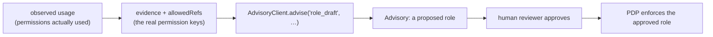

# Draft a least-privilege role

**Goal.** From observed usage (which permissions a role *actually* exercised), get a draft of a **tighter**
role — fewer grants, same job done — that a human reviews and the PDP then enforces.

::: callout danger "This is a draft, never an enforcement"
The output is an `Advisory`. A human approves it; the PDP enforces the approved policy. The AI never edits
grants and never decides. Treat the draft as a starting point for review, not a change to apply blindly.
:::

The module ships one concrete module, [`AccessExplainer`](/guides/explain-a-denial). Drafting a role is a
*pattern you build on `AdvisoryClient`* — the same governed pipeline (redaction → transport → guard → audit,
deterministic fallback) applied to a different task. This guide shows the pattern.

## The shape of the call

`AdvisoryClient::advise()` takes everything the governance layer needs: the task label, system + user prompts,
the **real evidence** the model may cite, the **`allowedRefs`** whitelist, and a **deterministic fallback**.



## A worked module

```php
use Padosoft\Iam\Ai\AdvisoryClient;
use Padosoft\Iam\Ai\Advisory;

final class LeastPrivilegeDrafter
{
    private const SYSTEM = 'You are a security assistant. Propose a tighter role using ONLY the permission '
        .'keys present in the evidence. Never invent permissions. Never claim the role should be granted — '
        .'a human approves and the PDP enforces.';

    public function __construct(private readonly AdvisoryClient $client) {}

    /**
     * @param list<string> $usedPermissions  permission keys the role actually exercised (real evidence)
     */
    public function draft(string $roleKey, array $usedPermissions): Advisory
    {
        $evidence = [
            'role'             => $roleKey,
            'used_permissions' => $usedPermissions,
        ];

        // The model may cite only the role key and the real permission keys.
        $allowedRefs = array_merge([$roleKey], $usedPermissions);

        // A genuinely useful non-AI answer: the minimal set is exactly what was used.
        $fallback = "Suggested least-privilege role {$roleKey}: "
            .implode(', ', $usedPermissions).' (based on observed usage).';

        return $this->client->advise(
            task: 'role_draft',
            system: self::SYSTEM,
            userPrompt: "Propose a least-privilege version of role {$roleKey} from its observed usage.",
            evidence: $evidence,
            allowedRefs: $allowedRefs,
            deterministicFallback: $fallback,
        );
    }
}
```

```php
$advisory = app(LeastPrivilegeDrafter::class)->draft('warehouse:operator', [
    'orders:read', 'orders:pick', 'stock:read',
]);

echo $advisory->text;       // a proposed role, citing only the real permission keys
$advisory->guardPassed;     // false if the model invented a permission → you got the deterministic draft
$advisory->aiUsed;          // false if AI is off → deterministic draft from observed usage
```

## Why this is safe by construction

- **The guard whitelist is the real permission set.** Because `allowedRefs` is exactly the keys you observed,
  any invented permission in the model's draft is a violation → the deterministic draft is returned instead.
- **The fallback is already correct.** With the AI off, the "draft" is the minimal set actually used — a sound
  least-privilege baseline the model can only refine.
- **Nothing is applied.** `advise()` returns text. Applying a role is a separate, human-gated, PDP-enforced
  step in `laravel-iam-server`.
- **It's audited.** The action is recorded under `stream=ai` with `task=role_draft` and the governance flags.

## ADR

::: collapsible "ADR — role drafting is advisory, with the permission set as the guard whitelist"
**Problem.** Auto-tightening roles with an LLM risks inventing permissions or being trusted to apply changes.

**Decision.** Express role drafting as an `AdvisoryClient` task whose `allowedRefs` is the real, observed
permission set and whose fallback is the observed-usage minimal set. Never apply the draft automatically.

**Consequences.** Invented permissions are rejected by the guard ✅ · the deterministic draft is already a
sound baseline ✅ · the human + PDP remain in the loop ✅ · the *quality* of the refinement depends on the
model and the usage data you feed it ⚠️.
:::

## Gotchas

::: callout warning
- **Feed real, recent usage as evidence.** A draft built from stale or partial usage can be *too* tight and
  break the job. The model only refines what you give it.
- **Keep permission keys in a guarded format.** Prefixed/namespaced keys (`orders:read`) are exact-matched in
  `allowedRefs`; the guard's identifier recognizers don't cover free-form text, so the whitelist match is what
  protects you here — make sure your real keys are in `allowedRefs`.
- **Approve before enforcing.** The advisory is a proposal. Route it through your access-request/review flow.
:::

## See also

- [The advisory pipeline](/architecture/advisory-pipeline) — the `advise()` contract.
- [Summarize an access review](/guides/summarize-access-review) — another module-on-client pattern.
- [Keep the AI out of the decision](/best-practices/keep-ai-out-of-decisions)
