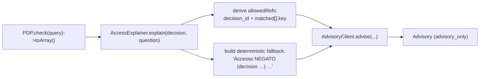

# Explain a denial

**Goal.** A user or support agent asks "Why was I denied?" and you want a clear, trustworthy sentence — not a
raw `explanation[]` array, and never a claim that the decision *should* have been different.

`AccessExplainer` is the module for this. It works **deterministically with the AI off**, gets nicer prose
when you enable a sovereign provider, and is **fail-closed** so it can never spuriously read as *allowed*.

## The flow



## Step by step

::: steps
1. **Get the PDP decision as an array**
   ```php
   $decision = $pdp->check($query)->toArray();
   // ['allowed' => false, 'decision_id' => 'dec_01H…', 'explanation' => ['no matching grant'], 'matched' => [...]]
   ```
2. **Ask the explainer**
   ```php
   use Padosoft\Iam\Ai\Modules\AccessExplainer;

   $advisory = app(AccessExplainer::class)->explain($decision, 'Why was this denied?');
   ```
3. **Show the text, trust the flags**
   ```php
   echo $advisory->text;        // human-readable, real citations only
   $advisory->citations;        // ['dec_01H…', 'orders:refund']
   $advisory->aiUsed;           // false until a provider is enabled
   $advisory->guardPassed;      // true unless the model invented an id
   ```
4. **Never gate on it**
   The advisory explains; the PDP decides. Keep enforcement on `$pdp->check($query)->allowed`.
:::

## What `explain()` does for you

- **Fail-closed verdict.** `allowed` is computed as `($decision['allowed'] ?? false) === true` — a strict
  boolean. A string `"false"`, a missing key, or anything unexpected collapses to **NEGATO**. The explanation
  never reads as *allowed* by accident.
- **Citations from real evidence.** It builds `allowedRefs` from the `decision_id` and each `matched[].key`,
  so the hallucination-guard has a precise whitelist and the model can only cite real grants.
- **A useful deterministic fallback.** It composes `Accesso NEGATO (decision dec_…)` plus the PDP's
  `explanation[]` — so even with the AI off, the answer is informative, not a stub.
- **A locked-down system prompt.** The model is instructed (in Italian) to explain concisely, cite only IDs
  present in the evidence, invent nothing, and never say whether access *should* be allowed.

## With the AI off vs. on

::: tabs
== tab "AI off (default)" icon:power-off
```php
$advisory = app(AccessExplainer::class)->explain($decision, 'Why was this denied?');
echo $advisory->text;
// "Accesso NEGATO (decision dec_01H…). no matching grant for orders:refund"
$advisory->aiUsed; // false
```
No network, no provider — just a clean composition of the PDP's own explanation.
== tab "AI on (sovereign)" icon:sparkles
```dotenv
IAM_AI_ENABLED=true
IAM_AI_PROVIDER=regolo
IAM_AI_MODEL=your-model
```
```php
$advisory = app(AccessExplainer::class)->explain($decision, 'Why was this denied?');
echo $advisory->text;
// A fluent paragraph citing only dec_01H… and orders:refund — guarded and re-redacted.
$advisory->aiUsed; // true
```
:::

## Worked end-to-end

```php
$query    = /* your PDP query */;
$decision = $pdp->check($query)->toArray();

$advisory = app(AccessExplainer::class)->explain($decision, 'Why was this denied?');

return response()->json([
    'message'     => $advisory->text,        // safe to show a support agent
    'references'  => $advisory->citations,   // real refs only
    'ai_assisted' => $advisory->aiUsed,
    // never: 'allowed' => derived from $advisory  ← gate on the PDP instead
    'allowed'     => $decision['allowed'] === true,
]);
```

## Gotchas

::: callout warning
- **Pass the full decision array**, including `decision_id` and `matched` — they become the citation whitelist.
  A bare `['allowed' => false]` yields a correct but reference-less explanation.
- **The verdict is fail-closed.** If an explanation surprisingly says NEGATO, verify `decision['allowed']` is a
  real boolean `true`, not `"true"` or absent.
- **`text` is prose, not a contract.** Don't regex it for allow/deny — read `$decision['allowed']` / the PDP.
:::

## See also

- [Audit & privacy](/concepts/audit-and-privacy) — the fail-closed boolean in context.
- [The hallucination guard](/concepts/hallucination-guard) — how citations are bounded.
- [PHP API](/reference/php-api) — `AccessExplainer::explain()` signature.
