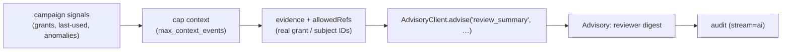

# Summarize an access review

**Goal.** An access-review (certification) campaign produces a lot of signal: who has what, what was used, what
looks anomalous. Hand a reviewer a **digest** instead of a spreadsheet — advisory, audited, and free of
invented references.

Like [drafting a role](/guides/draft-least-privilege-role), summarizing a review is a *pattern on
`AdvisoryClient`*, not a shipped module. The governed pipeline does the heavy lifting: redaction keeps PII out
of the prompt, the guard keeps invented IDs out of the digest, and the audit records the action without
storing the campaign's secrets.

## The flow



## A worked module

```php
use Padosoft\Iam\Ai\AdvisoryClient;
use Padosoft\Iam\Ai\Advisory;

final class AccessReviewSummarizer
{
    private const SYSTEM = 'You are a security assistant. Summarize an access review for a reviewer in '
        .'plain language. Cite ONLY the identifiers present in the evidence. Invent nothing. Do not say '
        .'whether access should be revoked — the reviewer decides and the PDP enforces.';

    public function __construct(private readonly AdvisoryClient $client) {}

    /**
     * @param array<string, mixed> $campaign  real signals: ['grants' => [...], 'anomalies' => [...]]
     * @param list<string>         $refs       real grant/subject identifiers the digest may cite
     */
    public function summarize(string $campaignId, array $campaign, array $refs): Advisory
    {
        // Respect the context cap so a huge campaign can't bloat the prompt.
        $maxEvents = (int) config('iam-ai.max_context_events', 50);
        $campaign['grants'] = array_slice($campaign['grants'] ?? [], 0, $maxEvents);

        $evidence = ['campaign' => $campaignId] + $campaign;

        $fallback = "Access review {$campaignId}: "
            .count($campaign['grants']).' grants reviewed, '
            .count($campaign['anomalies'] ?? []).' flagged for attention.';

        return $this->client->advise(
            task: 'review_summary',
            system: self::SYSTEM,
            userPrompt: "Summarize access-review campaign {$campaignId} for the reviewer.",
            evidence: $evidence,
            allowedRefs: array_merge([$campaignId], $refs),
            deterministicFallback: $fallback,
        );
    }
}
```

```php
$advisory = app(AccessReviewSummarizer::class)->summarize('campaign_01ARYZ6S41', [
    'grants'    => [/* real grants with ids */],
    'anomalies' => [/* e.g. 'grant unused 90d' */],
], $realGrantIds);

echo $advisory->text;     // a reviewer-ready digest, citing only real ids
$advisory->redacted;      // true if any PII/secret was stripped from the signals
$advisory->aiUsed;        // false → you still get the deterministic digest
```

## Why this is safe by construction

- **Redaction first.** Campaign signals can carry emails and IPs; they're stripped before the prompt is built,
  and again on the output. → [PRE-prompt redaction](/concepts/redaction)
- **The guard bounds the digest.** With `allowedRefs` = the real grant/subject IDs, the summary can't reference
  a grant that wasn't in the campaign.
- **Context is capped.** `max_context_events` (default 50) bounds how much history is passed — cost control and
  a smaller blast radius.
- **Audited, not stored.** The action is recorded under `task=review_summary`; prompts are never persisted and
  the digest only if you set `store_outputs=true` (sanitized).

## ADR

::: collapsible "ADR — review summaries are advisory, capped, and guarded"
**Problem.** Summarizing a certification campaign with an LLM risks leaking PII from the signals, inventing
grant references, or being read as a revocation recommendation.

**Decision.** Express the summary as an `AdvisoryClient` task: redact the signals, cap them at
`max_context_events`, whitelist the real IDs, and supply a deterministic count-based fallback. Keep the digest
descriptive — never a revoke/keep verdict.

**Consequences.** PII is stripped and IDs are bounded ✅ · context size is capped ✅ · the reviewer + PDP
decide ✅ · a very large campaign is truncated, so the digest reflects only the first N signals ⚠️.
:::

## Gotchas

::: callout warning
- **The cap truncates.** With more grants than `max_context_events`, the model sees only the first slice. Sort
  signals so the most decision-relevant ones survive the cap, or summarize in batches.
- **Don't turn it into a recommendation engine.** Keep the system prompt descriptive. A digest that says
  "revoke X" invites someone to act on AI output — gate revocations through the review/PDP flow.
- **Anomaly *detection* is your job, not the model's.** Feed computed anomalies as evidence; don't ask the
  model to find them — it can't cite what isn't there, and you don't want it inventing them.
:::

## See also

- [Audit & privacy](/concepts/audit-and-privacy)
- [Configuration](/operations/configuration) — `max_context_events`, `store_outputs`.
- [Draft a least-privilege role](/guides/draft-least-privilege-role)
