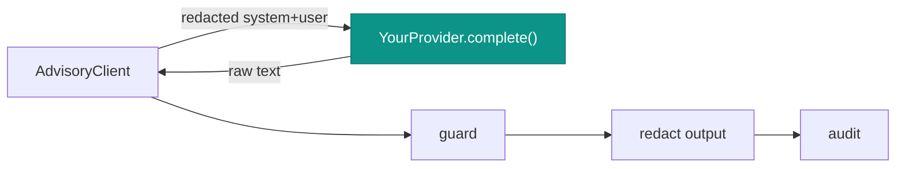

# Write a sovereign provider

**Goal.** Add a real AI transport — Regolo (EU), Ollama (on-prem), or your own sovereign endpoint — without
touching the governance layer. You implement one tiny interface and rebind it; redaction, the hallucination
guard, and audit keep running above it unchanged.

## The contract

`Padosoft\Iam\Ai\Contracts\AiProvider` is deliberately minimal — two methods:

```php
interface AiProvider
{
    /** Identifier for audit/telemetry: 'regolo' | 'ollama' | 'deterministic' | … */
    public function name(): string;

    /** Complete a prompt (system + user) and return the model's raw text. */
    public function complete(string $system, string $user): string;
}
```

The `complete()` you implement receives an **already-redacted** prompt and should return raw model text. You do
**not** redact, guard, or audit — the `AdvisoryClient` does that around your call.



## Implement it

```php
use Padosoft\Iam\Ai\Contracts\AiProvider;
use Illuminate\Support\Facades\Http;

final class MySovereignProvider implements AiProvider
{
    public function __construct(
        private readonly string $endpoint,
        private readonly string $model,
    ) {}

    public function name(): string
    {
        return 'my-sovereign'; // shows up in the Advisory + audit as the provider
    }

    public function complete(string $system, string $user): string
    {
        $response = Http::timeout(20)
            ->baseUrl($this->endpoint)
            ->post('/v1/chat/completions', [
                'model'    => $this->model,
                'messages' => [
                    ['role' => 'system', 'content' => $system],
                    ['role' => 'user',   'content' => $user],
                ],
            ])
            ->throw(); // let it throw — AdvisoryClient catches it and falls back deterministically

        return (string) data_get($response->json(), 'choices.0.message.content', '');
    }
}
```

::: callout tip "Throwing is fine — it fails safe"
If the endpoint is down, returns 5xx, or times out, just let `complete()` throw. The `AdvisoryClient` catches
**any** throwable and returns the deterministic fallback with `aiUsed = false`. You never need to invent a
fallback inside the provider. → [Fail-safe & fallback](/architecture/fail-safe-and-fallback)
:::

## Rebind it

Bind your provider in a service provider's `register()` (after the module's provider has registered its default
`DisabledProvider`):

```php
use Padosoft\Iam\Ai\Contracts\AiProvider;

public function register(): void
{
    $this->app->bind(AiProvider::class, fn () => new MySovereignProvider(
        endpoint: config('services.my_sovereign.endpoint'),
        model:    (string) config('iam-ai.model'),
    ));
}
```

Then turn the module on:

```dotenv
IAM_AI_ENABLED=true
IAM_AI_PROVIDER=my-sovereign
IAM_AI_MODEL=your-model
```

::: callout warning "The provider string must also be 'live'"
`IamAiServiceProvider` resolves its own default binding from `config('iam-ai.provider')` via a `match` that
currently falls through to `DisabledProvider`. Your rebind in a **later** service provider wins for the
container binding — but keep `IAM_AI_ENABLED=true`, or the `AdvisoryClient` short-circuits to the deterministic
path before ever calling your transport.
:::

## Verify with a fake first

The test suite shows the seam clearly — you can drive the whole pipeline with an anonymous provider:

```php
$provider = new class implements AiProvider {
    public function name(): string { return 'fake'; }
    public function complete(string $s, string $u): string {
        return 'Explanation citing dec_ABC12345.';
    }
};

$client = new AdvisoryClient($provider, new Redactor, new HallucinationGuard, app(AuditRecorder::class));
config(['iam-ai.enabled' => true]);

$advisory = $client->advise('t', 'sys', 'explain', [], ['dec_ABC12345'], 'fallback');
$advisory->aiUsed;      // true
$advisory->guardPassed; // true
```

## Checklist

::: steps
1. **Implement `AiProvider`** — `name()` + `complete()`. Return raw text; let failures throw.
2. **Keep it sovereign** — point it only at an EU/on-prem endpoint you control or contract.
3. **Rebind `AiProvider`** from your service provider's `register()`.
4. **Set env** — `IAM_AI_ENABLED=true`, `IAM_AI_PROVIDER=<your-name>`, `IAM_AI_MODEL=<model>`.
5. **Confirm `aiUsed`** on a returned `Advisory` — if it's `false` with `enabled=true`, the binding or
   transport isn't live.
:::

## Gotchas

::: callout warning
- **Don't redact or guard inside the provider.** That's the client's job and doing it twice can corrupt the
  guard's whitelist match. Return the model's raw text.
- **Honor data residency.** A "sovereign" adapter that calls a non-EU endpoint defeats the entire posture —
  see [Provider sovereignty & residency](/best-practices/provider-sovereignty).
- **Set a timeout.** Without one, a hung endpoint blocks the request; with one, a timeout simply falls back
  deterministically.
:::

## See also

- [Sovereign by default](/concepts/sovereign-by-default)
- [The advisory pipeline](/architecture/advisory-pipeline)
- [PHP API](/reference/php-api) — the `AiProvider` and `DisabledProvider` reference.
