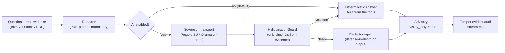

# Laravel IAM — AI

**AI that _assists_ your access governance — and never holds the decision.**

`padosoft/laravel-iam-ai` is the **optional AI module** of the [Laravel IAM](https://github.com/padosoft)
ecosystem. It adds natural-language **explanations**, least-privilege **suggestions**, and access-review
**summaries** — while making the dangerous half of "LLM + IAM" *structurally impossible*. Out of the box it
is **disabled**, the transport is **sovereign**, and the **PDP** in
[`laravel-iam-server`](https://doc.laravel-iam-server.padosoft.com) remains the sole authority over allow/deny.

::: callout danger "Advisory only — the PDP decides"
Every output of this module is an `Advisory`: a proposal flagged `advisory_only`. The deterministic
**Policy Decision Point** is the only authority over allow/deny. The AI *decorates* evidence — it never
replaces it, and it never decides. There is no code path where the model's word becomes the decision.
:::

## The one diagram that explains the whole module

## Why this package

Bolting an LLM onto an IAM system is tempting and dangerous: models **hallucinate** identifiers, **leak**
secrets into prompts, and — worst of all — get **trusted to make the call**. This module gives you the
useful half and removes the unsafe half by construction:

::: grids
::: grid
::: card "The PDP, not the AI, decides" icon:gavel
Every AI output is an `Advisory` flagged `advisory_only`. Authorization stays in the deterministic PDP.

[Advisory-only →](/concepts/advisory-only)
:::
:::
::: grid
::: card "Nothing leaks" icon:shield
A mandatory redaction pipeline strips tokens, keys, passwords, OTPs, emails and IPs *before* any prompt
leaves the process — and again on the output.

[PRE-prompt redaction →](/concepts/redaction)
:::
:::
::: grid
::: card "No invented evidence" icon:scan-eye
A hallucination-guard rejects any answer that cites an ID not present in the real evidence; the response
falls back to deterministic text.

[The hallucination guard →](/concepts/hallucination-guard)
:::
:::
::: grid
::: card "Sovereign & off by default" icon:globe-lock
`enabled=false` and the transport is `disabled` — no data leaves your perimeter. When you opt in, the
recommended providers are **Regolo (EU)** or **Ollama (on-prem)**. OpenAI is never a default.

[Sovereign by default →](/concepts/sovereign-by-default)
:::
:::
:::

> **"Deterministic first, AI second."** If the AI is off, the transport fails, or the guard rejects the
> output, you always get the deterministic answer built from your tools.

## What you can do with it

- **"Why was I denied?"** — turn a terse PDP `explanation[]` into a clear sentence for a support agent or
  end user, without ever claiming the decision *should* have been different.
  → [Explain a denial](/guides/explain-a-denial)
- **Draft a least-privilege role** — let the AI propose a tightened role from observed usage; a human
  approves it and the PDP enforces it.
  → [Draft a least-privilege role](/guides/draft-least-privilege-role)
- **Summarize an access review** — condense a campaign's signals into a digest for the reviewer — advisory,
  fully audited, with no secrets in the trail.
  → [Summarize an access review](/guides/summarize-access-review)

## Where to start

::: steps
1. **Install in 30 seconds**
   `composer require padosoft/laravel-iam-ai` — and nothing happens until you opt in.
   → [Quickstart](/quickstart)
2. **Understand the model**
   Five entities, one pipeline, one promise: the AI can't decide.
   → [Core concepts](/core-concepts)
3. **Go deep**
   Theory, diagrams, ADRs and a full PHP API reference.
   → [Architecture overview](/architecture/overview)
:::

## The Laravel IAM ecosystem

This module is one optional piece of a larger, deterministic IAM platform. It depends on
`laravel-iam-server` (for the audit recorder) and `laravel-iam-contracts`, and is **never** required by them.

| Package | Role |
| --- | --- |
| [laravel-iam-contracts](https://doc.laravel-iam-contracts.padosoft.com) | Shared interfaces & DTOs (PDP, KeyProvider, Assurance, FeatureScope) — the dependency root |
| [laravel-iam-server](https://doc.laravel-iam-server.padosoft.com) | The IAM server: identity, org, Application Registry + manifest, PDP (RBAC+ABAC+ReBAC), OAuth/OIDC, tamper-evident audit, IGA, Admin API + panel |
| [laravel-iam-client](https://doc.laravel-iam-client.padosoft.com) | Client for consumer apps: OIDC login, JWT/JWKS, introspection, `iam.auth`/`iam.can` middleware, Gate adapter, policy cache, webhooks |
| **laravel-iam-ai** *(this package)* | Optional AI module: advisory-only governance (redaction + hallucination-guard + audit) on a sovereign transport |
| [laravel-iam-directory](https://doc.laravel-iam-directory.padosoft.com) | Optional directory module: LDAP / Active Directory (LdapRecord) |
| [laravel-iam-bridge-spatie-permission](https://doc.laravel-iam-bridge-spatie-permission.padosoft.com) | Migration bridge from spatie/laravel-permission: scan, manifest, shadow mode, cutover, rollback |
| [laravel-iam-node](https://doc.laravel-iam-node.padosoft.com) | SDK client Node/TS (`@padosoft/laravel-iam-node`), thin + fail-closed |
| [laravel-iam-react-native](https://doc.laravel-iam-react-native.padosoft.com) | SDK client React Native (`@padosoft/laravel-iam-react-native`), thin + hooks |
| [laravel-iam-rust](https://doc.laravel-iam-rust.padosoft.com) | SDK client Rust (`laravel-iam` on crates.io), async + blocking, fail-closed |
