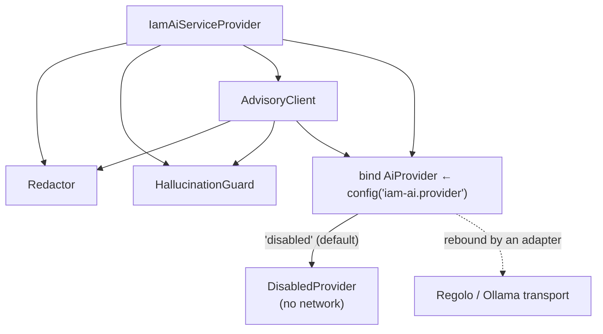

# Installation

## Requirements

| Requirement | Version / note |
| --- | --- |
| PHP | **8.3+** (`"php": "^8.3"`) |
| Laravel | Any currently supported release |
| `padosoft/laravel-iam-server` | `^1.0` — provides the `AuditRecorder` and the PDP whose decisions you explain |
| `padosoft/laravel-iam-contracts` | `^1.0` — pulled in transitively |
| `spatie/laravel-package-tools` | `^1.16` — package scaffolding (transitive) |

No AI SDK is required. Real providers (Regolo / Ollama) are **optional adapter packages** you add later,
explicitly. Nothing in `require` reaches a model.

## Install

```bash
composer require padosoft/laravel-iam-ai
```

The service provider `Padosoft\Iam\Ai\IamAiServiceProvider` is registered automatically through Laravel
**package auto-discovery** (declared under `extra.laravel.providers` in `composer.json`). No manual
registration is needed.

## Publish the configuration

```bash
php artisan vendor:publish --tag=laravel-iam-ai-config
```

This writes `config/iam-ai.php`. See [Configuration](/operations/configuration) for every key. The shipped
defaults are deliberately **sovereign and off**:

```php
'enabled'       => false,      // master switch
'provider'      => 'disabled', // DisabledProvider — no network calls
'redaction'     => true,       // mandatory PRE-prompt redaction
'store_prompts' => false,      // prompts are never persisted
'store_outputs' => false,      // sanitized output in audit only if you opt in
```

::: callout success "Safe by default"
After install the module is **disabled** and the transport is `DisabledProvider`. It does nothing — and
sends nothing anywhere — until you opt in and pick a sovereign provider. There is no OpenAI dependency to
remove because there is none to begin with.
:::

## What gets registered

The service provider binds the governance services and resolves the transport from config:



The default binding resolves to `DisabledProvider`. When you install a sovereign adapter and set
`iam-ai.provider`, that adapter **rebinds** `Padosoft\Iam\Ai\Contracts\AiProvider` from its own service
provider — the governance layer above the transport is unchanged.

## Verify

A quick deterministic smoke test that needs no provider:

```php
use Padosoft\Iam\Ai\Modules\AccessExplainer;

$advisory = app(AccessExplainer::class)->explain(
    ['allowed' => false, 'decision_id' => 'dec_demo', 'explanation' => ['no matching grant']],
    'Why was this denied?'
);

// "Accesso NEGATO (decision dec_demo). no matching grant"
echo $advisory->text;
var_dump($advisory->aiUsed); // false
```

## Next

- [Quickstart](/quickstart) — the four-step path to your first audited explanation.
- [Core concepts](/core-concepts) — the mental model behind the module.
- [Enabling a sovereign provider](/operations/configuration#enabling-a-sovereign-provider) — when you're ready to turn the AI on.
