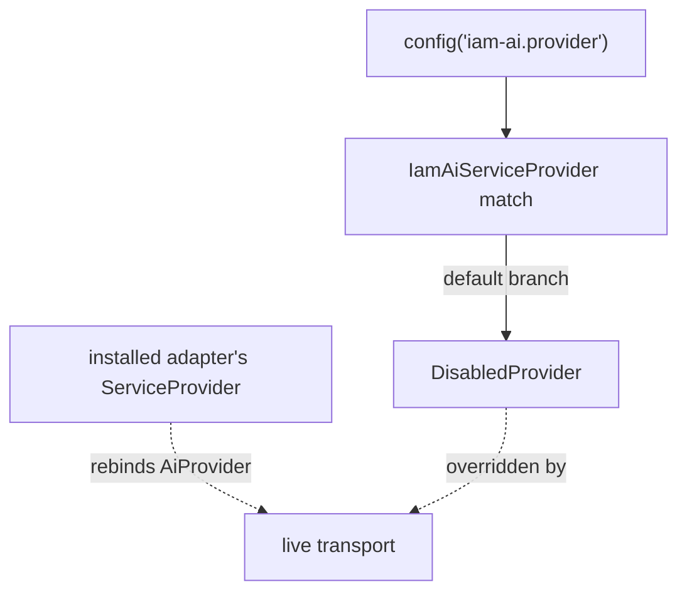

# Configuration

Publish the config first:

```bash
php artisan vendor:publish --tag=laravel-iam-ai-config
```

This writes `config/iam-ai.php`. The defaults are **sovereign and off**.

## Keys

| Key | Env | Default | Meaning |
| --- | --- | --- | --- |
| `enabled` | `IAM_AI_ENABLED` | `false` | Master switch. While `false`, the `DisabledProvider` is used and you get deterministic answers only. |
| `provider` | `IAM_AI_PROVIDER` | `disabled` | `disabled` \| `regolo` (EU) \| `ollama` (on-prem). Real providers are optional adapters. |
| `model` | `IAM_AI_MODEL` | `null` | Model name passed to the chosen provider. |
| `redaction` | — | `true` | The PRE-prompt redaction pipeline. Mandatory; leave it on. |
| `store_prompts` | — | `false` | Never persist prompts (possible PII/secrets). Hard default — no env override. |
| `store_outputs` | `IAM_AI_STORE_OUTPUTS` | `false` | Opt-in: store the **sanitized** output in the audit trail. |
| `max_context_events` | — | `50` | Cap on past events passed as model context. |

The shipped file:

```php
return [
    'enabled' => env('IAM_AI_ENABLED', false),

    // 'disabled' (default) | 'regolo' | 'ollama' — real providers are optional adapters.
    'provider' => env('IAM_AI_PROVIDER', 'disabled'),
    'model' => env('IAM_AI_MODEL'),

    'redaction' => true,            // mandatory pre-prompt redaction
    'store_prompts' => false,       // never persist prompts (possible PII/secrets)
    'store_outputs' => env('IAM_AI_STORE_OUTPUTS', false), // opt-in: sanitized output in audit
    'max_context_events' => 50,     // cap on past events passed as context
];
```

## Enabling a sovereign provider

::: callout warning "Never default to OpenAI"
The recommended providers are sovereign: **Regolo** (Italian/EU) or **Ollama** (on-prem). The core never wires
a non-sovereign provider as a default, and pulls in no AI SDK via `require`.
:::

::: tabs
== tab "Regolo (EU)" icon:cloud
```dotenv
IAM_AI_ENABLED=true
IAM_AI_PROVIDER=regolo
IAM_AI_MODEL=your-model
```
Install the adapter:
```bash
composer require padosoft/laravel-ai-regolo
```
== tab "Ollama (on-prem)" icon:server
```dotenv
IAM_AI_ENABLED=true
IAM_AI_PROVIDER=ollama
IAM_AI_MODEL=llama3.1
```
Point your transport adapter at your local Ollama endpoint.
== tab "Your own" icon:wrench
```dotenv
IAM_AI_ENABLED=true
IAM_AI_PROVIDER=my-sovereign
IAM_AI_MODEL=your-model
```
Implement `AiProvider` and rebind it — see [Write a sovereign provider](/guides/write-a-provider-adapter).
:::

The adapter rebinds the `Padosoft\Iam\Ai\Contracts\AiProvider` binding. Redaction and the hallucination-guard
remain active regardless of provider.

## How the provider is resolved



The module's own provider currently `match`es every value to `DisabledProvider`; a real transport comes from an
**adapter package** that rebinds `AiProvider` from its own service provider. Setting `provider` without
installing such an adapter leaves you on the inert default.

## Audit & privacy keys in practice

- **`store_prompts=false`** is a hard default — prompts are never written, full stop.
- **`store_outputs=true`** persists only the **redacted** output, and only if you opt in.
- Every AI action is audited under `stream=ai` / `iam.ai.advisory` with the governance flags regardless of
  these toggles. → [Audit & privacy](/concepts/audit-and-privacy)

## Gotchas

::: callout warning
- **`enabled=true` without an adapter ⇒ deterministic answers.** The binding stays on `DisabledProvider` (its
  `complete()` throws → fallback). Check `Advisory::$aiUsed` / `$provider`.
- **`max_context_events` truncates.** Modules that pass history (e.g. review summaries) only see the first N —
  order signals by relevance.
- **Don't try to disable `redaction`.** The flag defaults to `true` and the client redacts unconditionally; it
  is not a performance toggle.
:::

## See also

- [Installation](/installation)
- [Write a sovereign provider](/guides/write-a-provider-adapter)
- [Observability & audit](/operations/observability)
