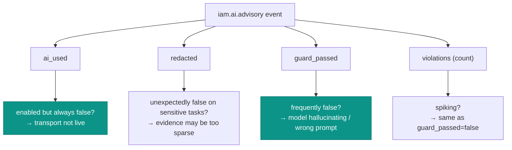

# Observability & audit

Every AI action this module takes is recorded — on **every** path, success or failure — in the
`laravel-iam-server` tamper-evident audit stream. This page is the operator's view: what's written, how to read
it, and what to alert on.

## What gets written

Each advisory produces one audit event:

| Field | Value |
| --- | --- |
| `stream` | `ai` |
| `event_type` | `iam.ai.advisory` |
| `metadata_json.task` | the task label (`access_explain`, `role_draft`, …) |
| `metadata_json.provider` | `deterministic` / `disabled` / `regolo` / `ollama` / … |
| `metadata_json.ai_used` | did a model actually run? |
| `metadata_json.redacted` | did redaction fire on input or output? |
| `metadata_json.guard_passed` | did the hallucination-guard approve? |
| `metadata_json.violations` | **count** of invented identifiers (not the IDs) |
| `metadata_json.output` | sanitized text **iff** `store_outputs=true`, else `null` |

Prompts are never written. → [Audit & privacy](/concepts/audit-and-privacy)

## Querying the stream

```php
use Padosoft\Iam\Domain\Audit\Models\AuditEvent;

// All AI actions, newest first
AuditEvent::query()
    ->where('event_type', 'iam.ai.advisory')
    ->latest()
    ->get();

// Guard rejections (the model invented an identifier)
AuditEvent::query()
    ->where('event_type', 'iam.ai.advisory')
    ->where('metadata_json->guard_passed', false)
    ->get();

// Calls that fell back despite the AI being enabled (possible outage / misconfig)
AuditEvent::query()
    ->where('event_type', 'iam.ai.advisory')
    ->where('metadata_json->ai_used', false)
    ->get();
```

## The four signals to watch



| Signal | Healthy | Investigate when |
| --- | --- | --- |
| `ai_used` | `true` when `enabled=true` | always `false` with `enabled=true` ⇒ adapter not bound / transport down |
| `guard_passed` | mostly `true` | frequently `false` ⇒ model inventing IDs, or `allowedRefs` too narrow |
| `violations` | mostly `0` | rising ⇒ same root cause as `guard_passed=false` |
| `redacted` | varies by input | track for "is sensitive data reaching prompts?" trends |

## Suggested alerts

::: steps
1. **Silent fallback** — `enabled=true` AND `ai_used=false` rate above a small threshold ⇒ the provider is down
   or unbound. Users are getting deterministic answers without knowing.
2. **Hallucination spike** — `guard_passed=false` rate climbing ⇒ a misbehaving model/prompt or an evidence
   pipeline that stopped supplying real refs.
3. **Provider drift** — unexpected `provider` values ⇒ a config/binding change you didn't intend.
:::

## Reading a single interaction

```php
$event = AuditEvent::query()
    ->where('event_type', 'iam.ai.advisory')
    ->latest()->first();

$m = $event->metadata_json;
// e.g. ['task' => 'access_explain', 'provider' => 'deterministic',
//       'ai_used' => false, 'redacted' => true, 'guard_passed' => true,
//       'violations' => 0, 'output' => null]
```

From metadata alone you can reconstruct *what the module did* — ran or fell back, redacted or not, guarded
clean or rejected — without ever exposing the prompt or the secret.

## Gotchas

::: callout warning
- **`violations` is a count, not the IDs.** To see which identifiers were invented, inspect the returned
  `Advisory` at call time; the trail deliberately doesn't store fabricated evidence.
- **`output` is `null` unless `store_outputs=true`.** Absence of output text is the default privacy posture,
  not a missing event.
- **Fallbacks are silent by design.** The audit is how you *notice* them — without these alerts, an outage
  looks like normal (deterministic) operation.
:::

## See also

- [Audit & privacy](/concepts/audit-and-privacy)
- [Fail-safe & fallback](/architecture/fail-safe-and-fallback)
- [Provider sovereignty & residency](/best-practices/provider-sovereignty)
