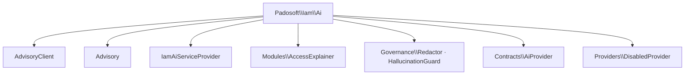

# PHP API

All classes live under `Padosoft\Iam\Ai\`. Signatures below match the source exactly.

## `AdvisoryClient`

The governance orchestrator. `final class`.

```php
public function __construct(
    AiProvider $provider,
    Redactor $redactor,
    HallucinationGuard $guard,
    ?AuditRecorder $audit = null,
);

/**
 * @param array<array-key, mixed> $evidence    real facts the model may cite
 * @param list<string>            $allowedRefs  identifiers allowed in the output
 */
public function advise(
    string $task,
    string $system,
    string $userPrompt,
    array $evidence,
    array $allowedRefs,
    string $deterministicFallback,
): Advisory;
```

**Pipeline.** Reset `Redactor::didRedact` → redact prompt + evidence → if disabled, return
`deterministicFallback` → else call transport (catch any throwable → fallback) → run guard (violations →
fallback) → redact the output (defense-in-depth) → audit → return `Advisory`. Every path audits and returns an
`Advisory`. → [The advisory pipeline](/architecture/advisory-pipeline)

The optional `AuditRecorder` is `Padosoft\Iam\Domain\Audit\Pii\AuditRecorder` (from `laravel-iam-server`); when
`null`, it is resolved from the container at record time.

## `Advisory` *(final readonly)*

```php
public function __construct(
    string $text,
    array $citations = [],      // list<string> — refs to real evidence cited
    bool $aiUsed = false,
    bool $redacted = false,
    bool $guardPassed = true,
    array $violations = [],     // list<string> — invented ids caught by the guard
    string $provider = 'deterministic',
);

/** @return array<string, mixed> — adds 'advisory_only' => true */
public function toArray(): array;
```

→ Full field semantics: [Advisory contract](/reference/advisory-contract).

## `Modules\AccessExplainer`

```php
public function __construct(AdvisoryClient $client);

/**
 * @param array<string, mixed> $decision  PDP output (toArray): allowed, decision_id, explanation[], matched[]
 */
public function explain(array $decision, string $question = ''): Advisory;
```

Fail-closed: `allowed` is `($decision['allowed'] ?? false) === true`; anything else is `NEGATO`. Builds
`allowedRefs` from `decision_id` and each `matched[].key`, and a deterministic fallback from the verdict +
`explanation[]`. → [Explain a denial](/guides/explain-a-denial)

## `Governance\Redactor`

```php
public bool $didRedact = false;

/** @phpstan-impure mutates $didRedact */
public function redact(string $text): string;

/**
 * @param array<array-key, mixed> $data
 * @return array<array-key, mixed>
 * @phpstan-impure delegates to redact()
 */
public function redactArray(array $data): array;
```

Redacts (in order) Bearer/Basic, JWT, PEM private keys, explicit
`password|passwd|secret|client_secret|api_key|token|otp|recovery_code|cookie|set-cookie|session_id` values to
end-of-line, emails, IPv4, 32+ char hex, and 40+ char base64. Hex is matched before base64. `redactArray()`
preserves keys and recurses into nested arrays, redacting string values only. → [PRE-prompt redaction](/concepts/redaction)

## `Governance\HallucinationGuard`

```php
/**
 * @param list<string> $allowedRefs
 * @return list<string> refs cited in the output but NOT allowed
 */
public function violations(string $output, array $allowedRefs): array;

/** @param list<string> $allowedRefs */
public function passes(string $output, array $allowedRefs): bool;
```

Recognizes prefixed IDs (`prefix` 2–12 chars + `_`/`-` + ≥8 alphanumerics), bare ULIDs (26 chars), and UUIDs.
`passes()` is `violations() === []`. → [The hallucination guard](/concepts/hallucination-guard)

## `Contracts\AiProvider`

```php
public function name(): string;                          // 'regolo' | 'ollama' | 'deterministic' | …
public function complete(string $system, string $user): string;
```

The transport seam. Implementations receive an already-redacted prompt and return raw model text; throwing is
safe (the client falls back). → [Write a sovereign provider](/guides/write-a-provider-adapter)

## `Providers\DisabledProvider` *(implements `AiProvider`)*

```php
public function name(): string;                          // 'disabled'
public function complete(string $system, string $user): string; // throws \RuntimeException
```

The safe default. `complete()` throws — the `AdvisoryClient` then falls back to deterministic text. No network
calls. → [Sovereign by default](/concepts/sovereign-by-default)

## `IamAiServiceProvider`

A `Spatie\LaravelPackageTools\PackageServiceProvider`. Registers the package (`hasConfigFile('iam-ai')`), binds
the governance services, and resolves `AiProvider` from `config('iam-ai.provider')` — the default `match`
branch returns `DisabledProvider`. Auto-discovered via `extra.laravel.providers`. Sovereign adapters rebind
`AiProvider` when installed. → [Installation](/installation)

## Config — `config/iam-ai.php`

See [Configuration](/operations/configuration) for every key. Defaults: `enabled=false`, `provider=disabled`,
`model=null`, `redaction=true`, `store_prompts=false`, `store_outputs=false`, `max_context_events=50`.

## Namespace map



## See also

- [Advisory contract](/reference/advisory-contract)
- [The advisory pipeline](/architecture/advisory-pipeline)
- [Core concepts](/core-concepts)
